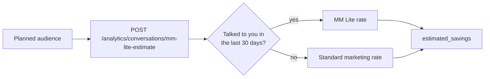

Meta bills WhatsApp per 24-hour conversation, not per message. These endpoints report the conversation counts and charges Meta recorded for your number, so you can see where the money goes before the invoice arrives.

<Info>
Who opened the conversation decides who pays. A **user-initiated** conversation starts when a customer messages you. A **business-initiated** conversation starts when you send a template to someone outside the 24-hour window. See [The 24-Hour Window & Opt-in](/guides/24-hour-window).
</Info>

## Full analytics

<CodeGroup>

```bash cURL
curl -X GET "https://api.megasend.co.il/analytics/conversations?instance_id=550e8400-e29b-41d4-a716-446655440000&days=30" \
  -H "X-MEGASEND-AUTH: YOUR_ACCESS_TOKEN"
```

```javascript JavaScript
const params = new URLSearchParams({
  instance_id: '550e8400-e29b-41d4-a716-446655440000',
  days: '30'
});

const response = await fetch(`https://api.megasend.co.il/analytics/conversations?${params}`, {
  headers: { 'X-MEGASEND-AUTH': 'YOUR_ACCESS_TOKEN' }
});

const { summary, cost_breakdown, daily_data } = await response.json();
```

```python Python
import requests

data = requests.get(
    'https://api.megasend.co.il/analytics/conversations',
    headers={'X-MEGASEND-AUTH': 'YOUR_ACCESS_TOKEN'},
    params={'instance_id': '550e8400-e29b-41d4-a716-446655440000', 'days': 30}
).json()

print(data['summary']['total_cost'])
```

</CodeGroup>

| Parameter | Type | Required | Description |
|-----------|------|----------|-------------|
| `instance_id` | UUID | ✅ | WhatsApp instance to report on |
| `days` | integer | ❌ | Days to look back. Defaults to 30. |
| `dimensions` | string | ❌ | Comma-separated Meta dimensions, for example `CONVERSATION_DIRECTION,CONVERSATION_TYPE` |

### Response

```json
{
  "summary": {
    "total_conversations": 3820,
    "business_initiated": 2410,
    "user_initiated": 1410,
    "total_cost": 187.4213,
    "business_initiated_cost": 174.9012,
    "user_initiated_cost": 12.5201
  },
  "type_summary": {
    "regular": 3512,
    "free_entry_point": 190,
    "free_tier": 118,
    "referral_conversion": 0
  },
  "cost_breakdown": [
    { "category": "MARKETING", "conversations": 2100, "cost": 151.2, "percentage": 55.0 },
    { "category": "UTILITY", "conversations": 1102, "cost": 30.9, "percentage": 28.8 },
    { "category": "SERVICE", "conversations": 618, "cost": 5.3, "percentage": 16.2 }
  ],
  "daily_data": [
    { "date": 1756425600, "conversations": 141, "cost": 6.82, "business_initiated": 90, "user_initiated": 51 }
  ],
  "data_points": []
}
```

| Field | Description |
|-------|-------------|
| `summary` | Conversation counts and charges, split by who started them |
| `type_summary` | Meta's conversation types, including the ones that cost nothing |
| `cost_breakdown` | Cost per category, sorted by conversation volume, with each category's share |
| `daily_data` | One entry per day for charting, ordered oldest first |
| `data_points` | The raw points Meta returned, kept for your own aggregation |

Costs are rounded to four decimals and expressed in the currency of your WhatsApp Business Account.

<Note>
`free_entry_point` conversations come from Click-to-WhatsApp ads and Facebook page CTAs. `free_tier` is Meta's monthly allowance of free service conversations. Both count toward `total_conversations` while adding nothing to `total_cost`, so a rising conversation count with a flat bill is normal.
</Note>

Results are cached for 15 minutes.

## Lighter variants

Two endpoints return slices of the same data when you do not need the whole payload:

<CodeGroup>

```bash Summary
curl -X GET "https://api.megasend.co.il/analytics/conversations/summary?instance_id=550e8400-e29b-41d4-a716-446655440000&days=7" \
  -H "X-MEGASEND-AUTH: YOUR_ACCESS_TOKEN"
```

```bash Costs
curl -X GET "https://api.megasend.co.il/analytics/conversations/costs?instance_id=550e8400-e29b-41d4-a716-446655440000&days=30" \
  -H "X-MEGASEND-AUTH: YOUR_ACCESS_TOKEN"
```

</CodeGroup>

`/summary` returns the totals and the direction split. `/costs` returns a flat cost view:

```json
{
  "instance_id": "550e8400-e29b-41d4-a716-446655440000",
  "days": 30,
  "total_cost": 187.4213,
  "business_initiated_cost": 174.9012,
  "user_initiated_cost": 12.5201,
  "total_conversations": 3820,
  "cost_breakdown": [
    { "category": "MARKETING", "conversations": 2100, "cost": 151.2, "percentage": 55.0 }
  ]
}
```

## MM Lite savings

Meta's Marketing Messages Lite pricing applies to marketing templates sent to people you have spoken with in the last 30 days. These endpoints tell you how much of an audience qualifies before you send.



### Estimate a campaign

<CodeGroup>

```bash cURL
curl -X POST "https://api.megasend.co.il/analytics/conversations/mm-lite-estimate" \
  -H "X-MEGASEND-AUTH: YOUR_ACCESS_TOKEN" \
  -H "Content-Type: application/json" \
  -d '{
    "instance_id": "550e8400-e29b-41d4-a716-446655440000",
    "recipient_count": 5000,
    "recipient_phone_numbers": ["+972501234567", "+972507654321"]
  }'
```

```python Python
estimate = requests.post(
    'https://api.megasend.co.il/analytics/conversations/mm-lite-estimate',
    headers={'X-MEGASEND-AUTH': 'YOUR_ACCESS_TOKEN'},
    json={
        'instance_id': '550e8400-e29b-41d4-a716-446655440000',
        'recipient_count': 5000,
        'recipient_phone_numbers': sample_numbers[:100]
    }
).json()

print(f"Estimated savings: {estimate['estimated_savings']}")
```

</CodeGroup>

| Field | Type | Required | Description |
|-------|------|----------|-------------|
| `instance_id` | UUID | ✅ | Instance the campaign will send from |
| `recipient_count` | integer | ✅ | Size of the full audience |
| `recipient_phone_numbers` | array | ❌ | A sample to check eligibility against, at most 100 numbers |
| `template_id` | string | ❌ | The marketing template you plan to send |

```json
{
  "total_recipients": 5000,
  "eligible_contacts": 1740,
  "eligibility_rate": 34.8,
  "estimated_regular_cost": 122.5,
  "estimated_mm_lite_cost": 89.3,
  "estimated_savings": 33.2,
  "savings_percentage": 27.1,
  "note": "Estimates are approximate. Actual MM Lite pricing is applied automatically by Meta based on conversation history and market eligibility. Savings shown are for MARKETING category templates only."
}
```

<Warning>
This is an estimate, not a quote. Meta applies MM Lite pricing itself, based on its own record of the conversation and on whether the market is eligible. Treat the numbers as planning input, and only for `MARKETING` templates.
</Warning>

When you pass a sample in `recipient_phone_numbers`, the eligibility rate is measured on that sample and projected onto `recipient_count`. Send a representative sample, not the first 100 rows of a sorted list.

### Who is currently eligible

```bash
curl -X GET "https://api.megasend.co.il/analytics/conversations/mm-lite-eligible?instance_id=550e8400-e29b-41d4-a716-446655440000" \
  -H "X-MEGASEND-AUTH: YOUR_ACCESS_TOKEN"
```

Returns the contacts that had a conversation in the last 30 days, with a preview list capped at 100 entries:

```json
{
  "total_recent_contacts": 1740,
  "eligible_count": 1740,
  "eligible_contacts": ["+972501234567"],
  "eligibility_rate": 100.0
}
```

## Next steps

<CardGroup cols={2}>
  <Card title="Analytics Overview" icon="chart-line" href="/analytics/overview">
    Message-level analytics from MegaSend's own records
  </Card>
  <Card title="Template Analytics" icon="chart-simple" href="/templates/analytics">
    Delivery, read and click rates per template
  </Card>
  <Card title="The 24-Hour Window" icon="clock" href="/guides/24-hour-window">
    Why a conversation is business initiated in the first place
  </Card>
  <Card title="Campaigns" icon="bullhorn" href="/campaigns/manage">
    Plan the send these estimates are for
  </Card>
</CardGroup>
