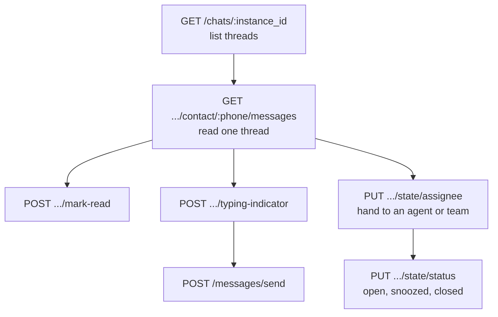

`/messages/responses` and `/messages/incoming` give you a flat list of messages. The conversations API gives you the inbox: one row per contact, ordered by last activity, with the unread count, the last message and the state of the 24-hour window already resolved for you.



## List conversations

<CodeGroup>

```bash cURL
curl -X GET "https://api.megasend.co.il/chats/550e8400-e29b-41d4-a716-446655440000?page=1&per_page=20" \
  -H "X-MEGASEND-AUTH: YOUR_ACCESS_TOKEN"
```

```javascript JavaScript
const params = new URLSearchParams({ page: '1', per_page: '20', filter: 'unread' });

const response = await fetch(
  `https://api.megasend.co.il/chats/550e8400-e29b-41d4-a716-446655440000?${params}`,
  { headers: { 'X-MEGASEND-AUTH': 'YOUR_ACCESS_TOKEN' } }
);

const { conversations, pagination } = await response.json();
```

```python Python
import requests

response = requests.get(
    'https://api.megasend.co.il/chats/550e8400-e29b-41d4-a716-446655440000',
    headers={'X-MEGASEND-AUTH': 'YOUR_ACCESS_TOKEN'},
    params={'page': 1, 'per_page': 20, 'filter': 'unread'}
)

conversations = response.json()['conversations']
```

</CodeGroup>

### Query parameters

| Parameter | Type | Description |
|-----------|------|-------------|
| `page` | integer | Page number, 1-based. Default `1`. |
| `per_page` | integer | Conversations per page |
| `search` | string | Match against contact name or phone number |
| `filter` | string | `all` (default), `unread`, or `mine` for threads assigned to the caller |
| `label_filter` | string | A label ID, or `unlabeled` for contacts with no labels |

### Response

```json
{
  "conversations": [
    {
      "id": "972546162881",
      "wa_id": "+972546162881",
      "contact_info": {
        "name": "John Doe",
        "phone": "+972546162881",
        "labels": [
          { "id": "8f14e45f-ceea-467a-9f7c-1a2b3c4d5e6f", "name": "VIP", "colorHex": "#FF5733" }
        ]
      },
      "last_message": {
        "text": "Is my order shipped yet?",
        "type": "text",
        "direction": "incoming",
        "status": "received"
      },
      "last_message_time": "2026-08-30T10:30:00Z",
      "last_message_direction": "incoming",
      "unread_count": 2,
      "conversation_status": "open",
      "snoozed_until": null,
      "assigned_agent_id": null,
      "assigned_agent_name": null,
      "assigned_team_id": null,
      "assigned_team_name": null,
      "customer_service_window": {
        "is_open": true,
        "expires_at": "2026-08-31T10:30:00Z",
        "can_send_freeform": true,
        "restriction_reason": null
      }
    }
  ],
  "pagination": {
    "total": 184,
    "page": 1,
    "per_page": 20,
    "has_more": true
  }
}
```

<Note>
`id` is the conversation key you pass as `contact_phone` in the endpoints below. For contacts who adopted a WhatsApp username it is their business-scoped user ID (BSUID) rather than a phone number, and `wa_id` is `null`. Always read `id` from the response instead of building it yourself.
</Note>

`unread_count` is capped at `99`. Additional fields may appear on a conversation row over time. Treat unknown keys as forward compatible and ignore them.

## Read one thread

Messages come back oldest first, so they render top to bottom without reversing.

<CodeGroup>

```bash cURL
curl -X GET "https://api.megasend.co.il/chats/550e8400-e29b-41d4-a716-446655440000/contact/972546162881/messages?per_page=50" \
  -H "X-MEGASEND-AUTH: YOUR_ACCESS_TOKEN"
```

```javascript JavaScript
const base = 'https://api.megasend.co.il/chats/550e8400-e29b-41d4-a716-446655440000/contact/972546162881/messages';

// First screen
let res = await fetch(`${base}?per_page=50`, {
  headers: { 'X-MEGASEND-AUTH': 'YOUR_ACCESS_TOKEN' }
});
let { messages, pagination } = await res.json();

// Scrolling up: ask for what came before the oldest message you hold
const oldest = messages[0].timestamp;
res = await fetch(`${base}?per_page=50&before_timestamp=${encodeURIComponent(oldest)}`, {
  headers: { 'X-MEGASEND-AUTH': 'YOUR_ACCESS_TOKEN' }
});
```

```python Python
base = 'https://api.megasend.co.il/chats/550e8400-e29b-41d4-a716-446655440000/contact/972546162881/messages'
headers = {'X-MEGASEND-AUTH': 'YOUR_ACCESS_TOKEN'}

page = requests.get(base, headers=headers, params={'per_page': 50}).json()

older = requests.get(base, headers=headers, params={
    'per_page': 50,
    'before_timestamp': page['messages'][0]['timestamp']
}).json()
```

</CodeGroup>

| Parameter | Type | Description |
|-----------|------|-------------|
| `page` | integer | Page number, 1-based |
| `per_page` | integer | Messages per page |
| `before_timestamp` | datetime | Return messages older than this, for infinite scroll |
| `search_query` | string | Search inside this conversation |
| `search_highlight` | boolean | Return match offsets alongside the results |

```json
{
  "messages": [
    {
      "id": "a1b2c3d4-e5f6-7890-abcd-ef1234567890",
      "direction": "incoming",
      "is_outgoing": false,
      "content": "Is my order shipped yet?",
      "message_type": "text",
      "timestamp": "2026-08-30T10:30:00Z",
      "status": "received",
      "wa_message_id": "wamid.HBgMOTcyNTQ2MTYyODgx",
      "reply_to_wa_message_id": null,
      "pricing_billable": false,
      "pricing_category": null,
      "conversation_expiration": "2026-08-31T10:30:00Z",
      "group_id": null,
      "metadata": {}
    }
  ],
  "pagination": {
    "total": 312,
    "page": 1,
    "per_page": 50,
    "has_more": true
  },
  "customer_service_window": {
    "is_open": true,
    "expires_at": "2026-08-31T10:30:00Z",
    "can_send_freeform": true,
    "restriction_reason": null
  }
}
```

<Tip>
`customer_service_window` on this response is the cheapest way to decide what you may send next. When `can_send_freeform` is `false`, only an approved template will go through. See [The 24-Hour Window & Opt-in](/guides/24-hour-window).
</Tip>

Passing `search_query` adds a `search` object with `total_matches`, `current_page_matches` and the IDs of the highlighted messages.

## Unread state

<CodeGroup>

```bash Mark read
curl -X POST "https://api.megasend.co.il/chats/550e8400-e29b-41d4-a716-446655440000/contact/972546162881/mark-read" \
  -H "X-MEGASEND-AUTH: YOUR_ACCESS_TOKEN"
```

```bash Mark unread
curl -X POST "https://api.megasend.co.il/chats/550e8400-e29b-41d4-a716-446655440000/contact/972546162881/mark-unread" \
  -H "X-MEGASEND-AUTH: YOUR_ACCESS_TOKEN"
```

```bash Mark everything read
curl -X POST "https://api.megasend.co.il/chats/550e8400-e29b-41d4-a716-446655440000/mark-all-read" \
  -H "X-MEGASEND-AUTH: YOUR_ACCESS_TOKEN"
```

```bash Badge counts
curl -X GET "https://api.megasend.co.il/chats/550e8400-e29b-41d4-a716-446655440000/unread-summary" \
  -H "X-MEGASEND-AUTH: YOUR_ACCESS_TOKEN"
```

</CodeGroup>

```json
{
  "total_unread_conversations": 12,
  "total_unread_messages": 37
}
```

Use `/unread-summary` for badge counts rather than adding up `unread_count` from the page you happen to have loaded. The summary is computed server side across every conversation.

## Assign and triage a thread

A thread has one owner. Naming a team clears the agent, and naming an agent clears the team, so the two fields are one slot with two vocabularies.

<CodeGroup>

```bash Assign to an agent
curl -X PUT "https://api.megasend.co.il/chats/550e8400-e29b-41d4-a716-446655440000/contact/972546162881/state/assignee" \
  -H "X-MEGASEND-AUTH: YOUR_ACCESS_TOKEN" \
  -H "Content-Type: application/json" \
  -d '{"assigned_agent_id": "7c9e6679-7425-40de-944b-e07fc1f90ae7"}'
```

```bash Assign to a team
curl -X PUT "https://api.megasend.co.il/chats/550e8400-e29b-41d4-a716-446655440000/contact/972546162881/state/assignee" \
  -H "X-MEGASEND-AUTH: YOUR_ACCESS_TOKEN" \
  -H "Content-Type: application/json" \
  -d '{"assigned_team_id": "3f2504e0-4f89-11d3-9a0c-0305e82c3301"}'
```

```bash Unassign
curl -X PUT "https://api.megasend.co.il/chats/550e8400-e29b-41d4-a716-446655440000/contact/972546162881/state/assignee" \
  -H "X-MEGASEND-AUTH: YOUR_ACCESS_TOKEN" \
  -H "Content-Type: application/json" \
  -d '{}'
```

</CodeGroup>

Set the disposition with `PUT .../state/status`:

```bash
curl -X PUT "https://api.megasend.co.il/chats/550e8400-e29b-41d4-a716-446655440000/contact/972546162881/state/status" \
  -H "X-MEGASEND-AUTH: YOUR_ACCESS_TOKEN" \
  -H "Content-Type: application/json" \
  -d '{"status": "snoozed", "snoozed_until": "2026-09-02T08:00:00Z"}'
```

| Status | Meaning |
|--------|---------|
| `open` | Active thread, the default for any conversation nobody has touched |
| `snoozed` | Hidden until `snoozed_until`. Omit `snoozed_until` to snooze until the customer writes again. |
| `closed` | Resolved. It reopens when the customer sends a new message. |

Both endpoints, and `GET .../state`, return the same object:

```json
{
  "conversation_status": "snoozed",
  "snoozed_until": "2026-09-02T08:00:00Z",
  "assigned_agent_id": "7c9e6679-7425-40de-944b-e07fc1f90ae7",
  "assigned_agent_name": "Dana L.",
  "assigned_team_id": null,
  "assigned_team_name": null
}
```

<Note>
`GET .../state` never returns `404`. A thread with no stored state answers with the defaults, because "open and unassigned" is a real state rather than a missing one.
</Note>

Call `GET /chats/{instance_id}/assignable-agents` for the list of agents you are allowed to assign to.

## Typing indicator

Show a "typing..." bubble on the customer's phone while your agent or bot composes a reply. It lasts up to 25 seconds, or until you send a message, whichever comes first.

```bash
curl -X POST "https://api.megasend.co.il/messages/typing" \
  -H "X-MEGASEND-AUTH: YOUR_ACCESS_TOKEN" \
  -H "Content-Type: application/json" \
  -d '{
    "instance_id": 42,
    "message_id": "wamid.HBgMOTcyNTQ2MTYyODgx"
  }'
```

| Field | Type | Required | Description |
|-------|------|----------|-------------|
| `instance_id` | integer | ✅ | Instance sending the indicator |
| `message_id` | string | ✅ | The `wamid.*` of a recent incoming message from that contact |

The indicator is free: it is not billed and it creates no message record. It needs a real incoming `wamid`, so you can only show it in reply to someone who wrote to you.

## Merged inbox across accounts

One contact writing to two of your numbers is two conversations, not one. `GET /chats/inbox` merges several accounts into a single list ordered by last activity, and tells you which account each row belongs to.

```bash
curl -X GET "https://api.megasend.co.il/chats/inbox?instance_ids=550e8400-e29b-41d4-a716-446655440000,660f9511-f3ac-52e5-b827-557766551111&per_page=20" \
  -H "X-MEGASEND-AUTH: YOUR_ACCESS_TOKEN"
```

| Response field | Description |
|----------------|-------------|
| `conversations` | The merged rows, newest activity first |
| `pagination` | Pagination over the merged list, not per account |
| `accounts` | The accounts actually served, after permission filtering |
| `skipped_instance_ids` | Requested IDs the caller cannot open an inbox on |
| `truncated` | `true` when the merge hit its depth limit, so later pages may be incomplete |

`GET /chats/inbox/unread-summary` gives the same badge counts across the merged set.

## Group threads

WhatsApp group conversations are listed separately from one-to-one threads:

| Endpoint | Purpose |
|----------|---------|
| `GET /chats/groups` | List group threads |
| `GET /chats/groups/{group_id}/messages` | Read a group thread |
| `POST /chats/groups/{group_id}/messages/{wa_message_id}/read` | Mark one group message read |

## History and contact sync

When you connect a number that has existing WhatsApp history, ask the platform to pull it in and poll for progress:

| Endpoint | Purpose |
|----------|---------|
| `POST /chats/request-history-sync/{instance_id}` | Start a message history sync |
| `GET /chats/history-sync-status/{instance_id}` | Poll history sync progress |
| `POST /chats/request-contacts-sync/{instance_id}` | Start a contact sync |
| `GET /chats/contacts-sync-status/{instance_id}` | Poll contact sync progress |

## Next steps

<CardGroup cols={2}>
  <Card title="Send Messages" icon="paper-plane" href="/messages/send">
    Reply to a thread with text, media, buttons or a template
  </Card>
  <Card title="The 24-Hour Window" icon="clock" href="/guides/24-hour-window">
    What `can_send_freeform: false` means, and how to get through anyway
  </Card>
  <Card title="Webhooks" icon="webhook" href="/webhooks/setup">
    Get notified of new messages instead of polling the inbox
  </Card>
  <Card title="Contact Labels" icon="tags" href="/contacts/labels">
    The labels behind `label_filter` and `contact_info.labels`
  </Card>
</CardGroup>
