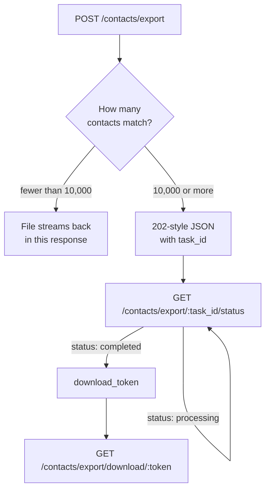

Export any slice of your contact list to CSV or XLSX. The same filters you use to browse contacts define what lands in the file, and you choose which columns to include.

## Two paths, one endpoint

`POST /contacts/export` decides for you based on how many contacts match:



<Note>
Check the `Content-Type` of the response before parsing it as JSON. The small path answers with `text/csv` or an XLSX media type and a `Content-Disposition` filename. The large path answers with `application/json`.
</Note>

## Request an export

<CodeGroup>

```bash cURL
curl -X POST "https://api.megasend.co.il/contacts/export" \
  -H "X-MEGASEND-AUTH: YOUR_ACCESS_TOKEN" \
  -H "Content-Type: application/json" \
  -o contacts.csv \
  -d '{
    "instance_id": "550e8400-e29b-41d4-a716-446655440000",
    "format": "csv",
    "columns": ["name", "phone_number", "labels", "created_at"],
    "active_only": true
  }'
```

```javascript JavaScript
const response = await fetch('https://api.megasend.co.il/contacts/export', {
  method: 'POST',
  headers: {
    'X-MEGASEND-AUTH': 'YOUR_ACCESS_TOKEN',
    'Content-Type': 'application/json'
  },
  body: JSON.stringify({
    instance_id: '550e8400-e29b-41d4-a716-446655440000',
    format: 'xlsx',
    columns: ['name', 'phone_number', 'labels'],
    label_id: '8f14e45f-ceea-467a-9f7c-1a2b3c4d5e6f'
  })
});

if (response.headers.get('content-type')?.includes('json')) {
  const { task_id, total_contacts } = await response.json();  // large export
} else {
  const blob = await response.blob();                          // file is ready
}
```

```python Python
import requests

response = requests.post(
    'https://api.megasend.co.il/contacts/export',
    headers={'X-MEGASEND-AUTH': 'YOUR_ACCESS_TOKEN'},
    json={
        'instance_id': '550e8400-e29b-41d4-a716-446655440000',
        'format': 'csv',
        'columns': ['name', 'phone_number', 'labels'],
        'date_from': '2026-01-01T00:00:00Z'
    }
)

if response.headers.get('content-type', '').startswith('application/json'):
    task_id = response.json()['task_id']
else:
    open('contacts.csv', 'wb').write(response.content)
```

</CodeGroup>

### Request fields

Every field is optional. Send `{}` to export every contact in the account with the default columns.

| Field | Type | Description |
|-------|------|-------------|
| `instance_id` | UUID | Limit to one instance. Omit for the whole account. |
| `format` | string | `csv` or `xlsx` |
| `columns` | array | Which columns to include, in order. See the list below. |
| `search` | string | Same free-text search as the contact list |
| `label_id` | UUID | Only contacts carrying this label |
| `unlabeled_only` | boolean | Only contacts with no labels at all |
| `blocked_only` | boolean | Only blocked contacts |
| `active_only` | boolean | Skip blocked and inactive contacts |
| `date_from` | datetime | Contacts created from this time onward |
| `date_to` | datetime | Contacts created up to this time |
| `selected_ids` | array | Export exactly these contact IDs and ignore the other filters |

### Available columns

`name`, `phone_number`, `status`, `labels`, `notes`, `bsuid`, `wa_username`, `country_code`, `created_at`, `updated_at`, `last_message_date`, `last_message_content`, `unread_count`

<Tip>
`bsuid` and `wa_username` matter for contacts who adopted a WhatsApp username: those rows can have an empty `phone_number`. Include both columns if your downstream system needs to re-identify every contact.
</Tip>

## Large exports

From 10,000 matching contacts the work moves to a background worker:

```json
{
  "task_id": "9d1c2b3a-4e5f-6789-abcd-ef0123456789",
  "status": "processing",
  "total_contacts": 42317,
  "message": "Export is being prepared in the background"
}
```

Poll until it finishes:

```bash
curl -X GET "https://api.megasend.co.il/contacts/export/9d1c2b3a-4e5f-6789-abcd-ef0123456789/status" \
  -H "X-MEGASEND-AUTH: YOUR_ACCESS_TOKEN"
```

```json
{
  "status": "completed",
  "progress": 42317,
  "total": 42317,
  "download_token": "b7c1f0e2d3a44f5b8c9d0e1f2a3b4c5d",
  "error": null
}
```

| Field | Description |
|-------|-------------|
| `status` | `processing`, `completed` or `failed` |
| `progress` / `total` | Rows written so far, and rows expected |
| `download_token` | Present once `status` is `completed` |
| `error` | Set when `status` is `failed` |

Then download the file:

```bash
curl -X GET "https://api.megasend.co.il/contacts/export/download/b7c1f0e2d3a44f5b8c9d0e1f2a3b4c5d" \
  -H "X-MEGASEND-AUTH: YOUR_ACCESS_TOKEN" \
  -o contacts.xlsx
```

<Warning>
A download token expires **24 hours** after the export completes, and the file is deleted with it. Download the file when the job finishes rather than storing tokens for later.
</Warning>

## Limits and errors

| Status | Meaning |
|--------|---------|
| `400` | No contacts match the filters you sent |
| `403` | The token cannot view contacts on the requested instance |
| `429` | Export rate limit reached: **5 exports per hour** per account |

The `429` body carries `remaining` and `reset_time` so you can tell the user when to try again:

```json
{
  "detail": {
    "message": "Export rate limit exceeded. Max 5 exports per hour.",
    "remaining": 0,
    "reset_time": "2026-08-31T14:00:00+00:00"
  }
}
```

## Next steps

<CardGroup cols={2}>
  <Card title="Contact Management" icon="address-book" href="/contacts/manage">
    Create, search and update the contacts you are exporting
  </Card>
  <Card title="Segments" icon="filter" href="/contacts/segments">
    Save a filter as a reusable segment instead of repeating it
  </Card>
</CardGroup>
