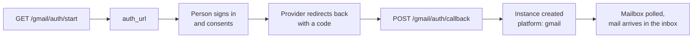

Connect a Gmail or a Microsoft Outlook mailbox and email becomes another MegaSend channel. Incoming mail appears as conversations next to WhatsApp and Instagram, replies go out from your real address, and the same automations apply.

Both mailboxes work the same way. Swap `gmail` for `outlook` in every path below.

## Connect a mailbox

Both providers use OAuth, so nobody hands MegaSend a password:



<Note>
Connecting is much easier from the dashboard at [app.megasend.co.il](https://app.megasend.co.il). Use the API when you are embedding the connection in your own product.
</Note>

```bash
curl -X GET "https://api.megasend.co.il/gmail/auth/start?nickname=Support%20mailbox" \
  -H "X-MEGASEND-AUTH: YOUR_ACCESS_TOKEN"
```

```json
{ "auth_url": "https://accounts.google.com/o/oauth2/v2/auth?..." }
```

Open `auth_url` in a browser or popup. After consent, pass the returned code to `POST /gmail/auth/callback`, which creates the instance:

```json
{ "instance_id": "550e8400-e29b-41d4-a716-446655440000", "gmail_address": "support@acme.example" }
```

<Note>
Your plan's instance limit is checked **before** the consent screen opens, so somebody at their limit is stopped early rather than after signing in. Reconnecting a mailbox you already own is always allowed, even at the cap. Connecting a genuinely new mailbox is not.
</Note>

## Check the connection

```bash
curl -X GET "https://api.megasend.co.il/gmail/status?instance_id=550e8400-e29b-41d4-a716-446655440000" \
  -H "X-MEGASEND-AUTH: YOUR_ACCESS_TOKEN"
```

<Warning>
A person can revoke MegaSend's access from their Google or Microsoft account at any time. When that happens sends fail with `INSTANCE_DISCONNECTED` and the mailbox needs reconnecting. Watch for that error code rather than assuming a connected mailbox stays connected.
</Warning>

Disconnect with `POST /gmail/disconnect?instance_id=...`. Conversation history stays in MegaSend.

## Send and receive email

Email uses the shared messaging endpoints. `recipient` is the email address:

```bash
curl -X POST "https://api.megasend.co.il/messages/send" \
  -H "X-MEGASEND-AUTH: YOUR_ACCESS_TOKEN" \
  -H "Content-Type: application/json" \
  -d '{
    "instance_id": "550e8400-e29b-41d4-a716-446655440000",
    "recipient": "customer@example.com",
    "message_type": "text",
    "text": "Thanks for getting in touch. Your order ships tomorrow."
  }'
```

### How the subject is chosen

There is no `subject` field on the send request. MegaSend derives it so replies thread correctly in the customer's mail client:

| Situation | Subject used |
|-----------|--------------|
| Replying inside an existing thread | `Re: <the original subject>`, and the mail is attached to that thread |
| No prior thread with this address | `Message from <your business name>` |

Outbound mail is sent as plain text. Inbound mail keeps its HTML: read it from `html_body` on the message, alongside `subject` and `email_thread_id`. Sanitize `html_body` before rendering it anywhere.

### No messaging window

Email has no 24-hour window and no template approval, so you can write to a contact whenever you like. Abuse control belongs to the provider, and to keep you the right side of it **email instances are deliberately excluded from campaigns**. Use email for conversations and transactional replies, not for bulk sending.

## Attachments

```bash
curl -X GET "https://api.megasend.co.il/gmail/550e8400-e29b-41d4-a716-446655440000/attachments/{gmail_message_id}/{attachment_id}" \
  -H "X-MEGASEND-AUTH: YOUR_ACCESS_TOKEN"
```

The IDs come from the inbound message's metadata. Outlook has the same endpoint keyed on `graph_message_id`.

## Automations

`GET` and `PUT /gmail/{instance_id}/automation-settings` hold three behaviours:

```bash
curl -X PUT "https://api.megasend.co.il/gmail/550e8400-e29b-41d4-a716-446655440000/automation-settings" \
  -H "X-MEGASEND-AUTH: YOUR_ACCESS_TOKEN" \
  -H "Content-Type: application/json" \
  -d '{
    "welcome": { "enabled": true, "text": "Thanks for writing in. We reply within one business day." },
    "away": { "enabled": true, "text": "Our office is closed. We will answer on the next business day." }
  }'
```

| Key | What it does |
|-----|--------------|
| `welcome` | `{ enabled, text }`, sent the first time an address writes to you |
| `away` | `{ enabled, text, business_hours }`, sent outside your business hours |
| `faq` | Keyword to action, either a canned reply or a flow |

<Warning>
The `PUT` **merges** at the top level. Sending only `{"welcome": {...}}` leaves `away` and `faq` untouched, but sending `{"faq": {...}}` replaces the entire FAQ map. Read the current settings first if you are adding one keyword.
</Warning>

<Note>
Automatic replies carry the RFC 3834 `Auto-Submitted: auto-replied` header, so another party's auto-responder will not answer them back and start a loop. Keep this in mind if you build your own auto-replies on top of webhooks: without that header two vacation responders can ping-pong indefinitely.
</Note>

## Next steps

<CardGroup cols={2}>
  <Card title="Conversations" icon="comments" href="/chats/conversations">
    Email threads in the shared inbox
  </Card>
  <Card title="Automation Flows" icon="diagram-project" href="/flows/manage">
    Route an incoming email into a flow
  </Card>
  <Card title="Contacts" icon="address-book" href="/contacts/manage">
    The people writing to your mailbox
  </Card>
  <Card title="Webhooks" icon="webhook" href="/webhooks/setup">
    Receive inbound mail on your own server
  </Card>
</CardGroup>
