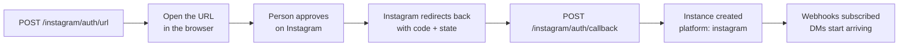
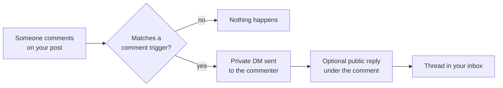

Connecting an Instagram professional account turns it into a MegaSend instance. Direct messages arrive in the same inbox as WhatsApp, a public comment can trigger a private DM, and you can publish and schedule posts through the API.

## How the connection works

Instagram uses OAuth rather than a token you paste in:



<Note>
Connecting is much easier from the dashboard at [app.megasend.co.il](https://app.megasend.co.il), which runs this whole flow for you. Use the API when you are embedding the connection in your own product.
</Note>

### Prerequisites

- An Instagram **professional** account (Business or Creator). A personal account cannot be connected, and the callback rejects it.
- The account must be reachable by the person completing the OAuth step.

### Step 1: get the authorization URL

```bash
curl -X POST "https://api.megasend.co.il/instagram/auth/url" \
  -H "X-MEGASEND-AUTH: YOUR_ACCESS_TOKEN" \
  -H "Content-Type: application/json" \
  -d '{}'
```

The response carries the URL to open. Its `state` parameter holds your user ID plus a one-time CSRF nonce that MegaSend stores for **one hour**, so the URL is single-use and short-lived. Generate a fresh one per connection attempt.

### Step 2: hand back the code

Instagram redirects to your configured URL with `code` and `state`. Pass both straight through:

```bash
curl -X POST "https://api.megasend.co.il/instagram/auth/callback" \
  -H "X-MEGASEND-AUTH: YOUR_ACCESS_TOKEN" \
  -H "Content-Type: application/json" \
  -d '{
    "code": "AQBx-...",
    "state": "{\"user_id\":\"...\",\"nonce\":\"...\"}",
    "nickname": "Acme on Instagram"
  }'
```

```json
{
  "instance_id": "550e8400-e29b-41d4-a716-446655440000",
  "ig_user_id": "17841400000000000",
  "ig_username": "acme.store",
  "ig_profile_picture_url": "https://scontent.cdninstagram.com/...",
  "ig_token_expires_at": "2026-10-30T09:00:00Z",
  "nickname": "Acme on Instagram",
  "platform": "instagram",
  "subscription_state": { "subscribed": true },
  "follower_detection_mode": "polling"
}
```

If the person denied access, send the `error` and `error_reason` Instagram returned instead of `code`, and the endpoint reports the failure cleanly.

<Warning>
`ig_token_expires_at` is real: Instagram long-lived tokens expire. MegaSend refreshes them for you, and `POST /instagram/auth/refresh/{instance_id}` forces a refresh if you need one. An account whose token has lapsed stops receiving DMs until it is reconnected.
</Warning>

An Instagram account can only be connected to one MegaSend account at a time. Reconnecting the same `ig_user_id` updates the existing instance rather than creating a duplicate.

## Send and receive DMs

Instagram instances use the shared messaging endpoints. `recipient` is the Instagram-scoped user ID (IGSID) you learn from the first inbound message, not an `@username`:

```bash
curl -X POST "https://api.megasend.co.il/messages/send" \
  -H "X-MEGASEND-AUTH: YOUR_ACCESS_TOKEN" \
  -H "Content-Type: application/json" \
  -d '{
    "instance_id": "550e8400-e29b-41d4-a716-446655440000",
    "recipient": "17841400000000000",
    "message_type": "text",
    "text": "Thanks for reaching out! Your order ships tomorrow."
  }'
```

### The messaging window

Instagram gives you **24 hours** from the customer's last message to reply freely. Two fields extend or redirect that:

| Field | What it does |
|-------|--------------|
| `use_human_agent_tag` | Extends the window to **7 days** using Meta's `HUMAN_AGENT` tag |
| `comment_id` | Sends the message as a private reply to a public comment |

```bash
-d '{
  "instance_id": "550e8400-e29b-41d4-a716-446655440000",
  "recipient": "17841400000000000",
  "message_type": "text",
  "text": "Following up on your issue: the replacement is on its way.",
  "use_human_agent_tag": true
}'
```

<Warning>
`use_human_agent_tag` is only legitimate when a **real person** is writing the reply, for an issue that genuinely needed more than a day. Meta rejects sends that abuse it, and repeated rejections put the account's messaging access at risk. Never set it from a bot.
</Warning>

## Turn comments into conversations

The most useful Instagram automation: someone comments a keyword on a post, and your business DMs them privately.



```bash
curl -X POST "https://api.megasend.co.il/instagram/550e8400-e29b-41d4-a716-446655440000/comment-triggers" \
  -H "X-MEGASEND-AUTH: YOUR_ACCESS_TOKEN" \
  -H "Content-Type: application/json" \
  -d '{
    "keyword": "LINK",
    "response_text": "Here is the link you asked for: https://acme.example/sale",
    "public_reply_text": "Sent you a DM!",
    "response_type": "text",
    "is_active": true
  }'
```

| Field | Description |
|-------|-------------|
| `keyword` | Matched case-insensitively. Use `*` with `response_type: "story_mention"` to match every story mention. |
| `response_text` | The DM to send |
| `public_reply_text` | An optional public reply posted under the comment |
| `response_type` | `text`, `product`, `generic_template`, `story_mention` or `story_reply` |
| `product_retailer_ids` | Catalog product IDs, for `product` responses |
| `media_filter` | A specific `media_id` to restrict the trigger to one post, or `null` for all posts |
| `is_active` | Turn the trigger off without deleting it |

The response includes `trigger_count` and `last_triggered_at`, and `GET /instagram/{instance_id}/comment-triggers/analytics` reports how each keyword performs.

### Replying to a comment directly

| Endpoint | Purpose |
|----------|---------|
| `POST .../comments/{comment_id}/reply` | Public reply under the comment |
| `POST .../comments/{comment_id}/private-reply` | Private DM to the comment's author |
| `POST .../comments/{comment_id}/hide` | Hide the comment |
| `DELETE .../comments/{comment_id}` | Delete the comment |

<Note>
Instagram permits **one** private reply per comment, within **7 days** of the comment being posted. A second attempt on the same comment fails, so treat the first one as your only shot.
</Note>

### Comment moderation rules

`.../comment-moderation/rules` hides comments automatically by rule, for example spam or a banned word list. `.../comment-moderation/rules/preview` and `.../rules/{rule_id}/preview` show what a rule would have hidden before you switch it on, and `.../comment-moderation/actions` is the audit trail, with an `unhide` endpoint to reverse a decision.

## Greeting people who arrive

| Endpoint | What it configures |
|----------|--------------------|
| `PUT .../welcome-message` | The DM sent when someone opens a conversation for the first time |
| `POST .../ice-breakers` | Up to **4** tappable prompts shown before the person types |
| `POST .../persistent-menu` | The menu available throughout the conversation |
| `PUT .../away-message` | The automatic reply outside your business hours |
| `PUT .../follower-automation` | A DM sent when someone new follows you |

Each has a matching `GET` to read the current value and a `DELETE` to remove it.

```bash
curl -X PUT "https://api.megasend.co.il/instagram/550e8400-e29b-41d4-a716-446655440000/welcome-message" \
  -H "X-MEGASEND-AUTH: YOUR_ACCESS_TOKEN" \
  -H "Content-Type: application/json" \
  -d '{"response_text": "Hey! Thanks for reaching out. How can we help?", "is_active": true}'
```

## Publish posts

| Endpoint | Publishes |
|----------|-----------|
| `POST .../publish/image` | A single feed image |
| `POST .../publish/video` | A video or reel |
| `POST .../publish/carousel` | A multi-image carousel |
| `POST .../publish/story` | A story |
| `POST .../publish/upload` | Uploads a local file and gives you a URL to publish |
| `GET .../publish/limit` | How much of Instagram's publishing quota is left |

```bash
curl -X POST "https://api.megasend.co.il/instagram/550e8400-e29b-41d4-a716-446655440000/publish/image" \
  -H "X-MEGASEND-AUTH: YOUR_ACCESS_TOKEN" \
  -H "Content-Type: application/json" \
  -d '{
    "image_url": "https://cdn.example.com/new-arrival.jpg",
    "caption": "New in store this week. Comment LINK for the shop page.",
    "collaborators": ["partner.brand"],
    "idempotency_key": "spring-drop-2026-09-01"
  }'
```

```json
{
  "success": true,
  "container_id": "17900000000000000",
  "media_id": "17800000000000000",
  "media_type": "IMAGE",
  "child_count": 0,
  "idempotent_replay": false
}
```

<Tip>
Always send an `idempotency_key`. A retry with the same key inside a 10-minute window returns the original result with `idempotent_replay: true` instead of publishing the post twice.
</Tip>

`image_url` must be a publicly reachable HTTPS URL, because Instagram fetches it directly. Use `POST .../publish/upload` first if the file only exists locally.

### Scheduling

`POST .../schedule` queues a post for later, `GET .../schedule` lists what is queued, and `DELETE .../schedule/{post_id}` cancels one.

## Insights

| Endpoint | Reports |
|----------|---------|
| `GET .../insights/account` | Reach, impressions and profile activity |
| `GET .../insights/account-summary` | The stored summary, without calling Meta |
| `GET .../insights/demographics` | Audience age, gender and location |
| `GET .../insights/posts` | Stored per-post performance |
| `GET .../insights/media/{media_id}` | One post in detail |
| `GET .../follower-stats` and `.../follower-analytics` | Follower growth and events |
| `GET .../analytics` | The combined view MegaSend renders in the dashboard |
| `GET .../ad-attribution` | Conversations that started from an ad |

## Keeping webhooks healthy

DMs and comments arrive over Meta webhooks, which MegaSend subscribes to during the OAuth callback. If that subscription lapses, inbound stops without an error anywhere:

| Endpoint | Purpose |
|----------|---------|
| `GET .../webhook/subscription` | Current subscription state |
| `POST .../webhook/subscribe` | Retry a failed subscription |
| `POST .../webhooks/resubscribe` | Force a fresh subscription |

<Warning>
If Instagram DMs suddenly stop arriving while sending still works, check the subscription first. Webhook subscription drift is the most common cause, and reconnecting the account is not needed to fix it.
</Warning>

## Next steps

<CardGroup cols={2}>
  <Card title="Conversations" icon="comments" href="/chats/conversations">
    Instagram threads in the shared inbox
  </Card>
  <Card title="Send Messages" icon="paper-plane" href="/messages/send">
    The endpoint every channel shares
  </Card>
  <Card title="Automation Flows" icon="diagram-project" href="/flows/manage">
    Answer a DM with a full flow instead of one reply
  </Card>
  <Card title="Messenger Channel" icon="facebook-messenger" href="/instances/messenger">
    The other Meta inbox, with the same OAuth shape
  </Card>
</CardGroup>
