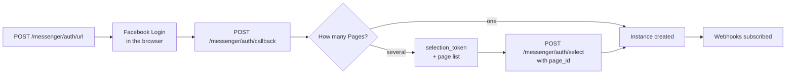

Connecting a Facebook Page turns Messenger into a MegaSend instance. Conversations land in the same inbox as WhatsApp and Instagram, and you send replies through the same messaging endpoints.

## Connect a Page

Messenger uses Facebook Login. A person with admin rights on the Page approves the connection, and because one Facebook account often administers several Pages, the flow has a page-picking step.



<Note>
Connecting is much easier from the dashboard at [app.megasend.co.il](https://app.megasend.co.il), which runs this flow for you. Use the API when you are embedding the connection in your own product.
</Note>

`POST /messenger/auth/url` mints the state and CSRF nonce for the login, valid for **one hour**. After the person approves, hand the result to `POST /messenger/auth/callback`. When the response comes back with a `selection_token` and a list of Pages, let the person choose one and finish with:

```bash
curl -X POST "https://api.megasend.co.il/messenger/auth/select" \
  -H "X-MEGASEND-AUTH: YOUR_ACCESS_TOKEN" \
  -H "Content-Type: application/json" \
  -d '{
    "selection_token": "st_9d1c2b3a...",
    "page_id": "102938475610293",
    "nickname": "Acme Page"
  }'
```

You get back the `instance_id` to use everywhere else.

## Send and receive messages

Messenger instances use the shared messaging endpoints. `recipient` is the Page-scoped user ID (PSID) you learn from the first inbound message:

```bash
curl -X POST "https://api.megasend.co.il/messages/send" \
  -H "X-MEGASEND-AUTH: YOUR_ACCESS_TOKEN" \
  -H "Content-Type: application/json" \
  -d '{
    "instance_id": "550e8400-e29b-41d4-a716-446655440000",
    "recipient": "6123456789012345",
    "message_type": "text",
    "text": "Thanks for your message! Your order ships tomorrow."
  }'
```

### The 24-hour window

Meta gives you **24 hours** from the customer's last message to reply freely. Three routes exist past that:

| Route | When it applies |
|-------|-----------------|
| `use_human_agent_tag: true` | A **person** is answering an issue that took longer than a day. Extends the window to 7 days, text only. |
| A utility template | A pre-approved transactional message, such as an order or appointment update |
| A confirmation message | A structured order or booking confirmation, see below |

<Warning>
`use_human_agent_tag` is for real human replies only. Sending it from a bot violates Meta's policy and puts the Page's messaging access at risk.
</Warning>

## Utility templates

Utility templates are approved transactional messages, the Messenger equivalent of a WhatsApp `UTILITY` template. They are the supported way to reach someone after the window closes.

<CodeGroup>

```bash Create
curl -X POST "https://api.megasend.co.il/messenger/550e8400-e29b-41d4-a716-446655440000/utility-templates" \
  -H "X-MEGASEND-AUTH: YOUR_ACCESS_TOKEN" \
  -H "Content-Type: application/json" \
  -d '{
    "name": "order_shipped",
    "language": "en_US",
    "header_text": "Your order is on its way",
    "body_text": "Hi {{1}}, order {{2}} shipped today and arrives on {{3}}.",
    "example_values": ["Dana", "#12345", "Friday"],
    "buttons": [{ "type": "url", "title": "Track order", "url": "https://acme.example/track" }]
  }'
```

```bash List
curl -X GET "https://api.megasend.co.il/messenger/550e8400-e29b-41d4-a716-446655440000/utility-templates" \
  -H "X-MEGASEND-AUTH: YOUR_ACCESS_TOKEN"
```

```bash Send
curl -X POST "https://api.megasend.co.il/messenger/550e8400-e29b-41d4-a716-446655440000/utility-templates/send" \
  -H "X-MEGASEND-AUTH: YOUR_ACCESS_TOKEN" \
  -H "Content-Type: application/json" \
  -d '{
    "recipient_psid": "6123456789012345",
    "template_name": "order_shipped",
    "language": "en_US",
    "parameters": ["Dana", "#12345", "Friday"]
  }'
```

</CodeGroup>

| Field | Required | Description |
|-------|----------|-------------|
| `name` | ✅ | Identifier you use when sending |
| `body_text` | ✅ | Message body, with `{{1}}`-style placeholders |
| `language` | ❌ | Locale code, for example `en_US` |
| `header_text` | ❌ | Bold line above the body |
| `buttons` | ❌ | Buttons attached to the message |
| `example_values` | ❌ | Sample values Meta uses when reviewing the template |

Delete one with `DELETE .../utility-templates/{name}`.

<Note>
The send endpoint resolves the template live from Meta. You get a `404` when the name does not exist, and a `400` when the template is not `APPROVED` yet or when the number of `parameters` does not match the placeholders in `body_text`.
</Note>

## Order and booking confirmations

For a confirmation with structure (line items, totals, a booking time) `POST .../confirmations/send` builds the receipt for you:

```bash
curl -X POST "https://api.megasend.co.il/messenger/550e8400-e29b-41d4-a716-446655440000/confirmations/send" \
  -H "X-MEGASEND-AUTH: YOUR_ACCESS_TOKEN" \
  -H "Content-Type: application/json" \
  -d '{
    "recipient_psid": "6123456789012345",
    "kind": "booking",
    "booking": {
      "title": "Fitting appointment",
      "starts_at": "2026-09-04T13:00:00Z",
      "location": "Acme Store, Tel Aviv"
    }
  }'
```

`kind` is `order` or `booking`, and you fill the matching object. The message is persisted, billed and broadcast exactly like any other outbound Messenger message, and the same 24-hour window rules apply.

## The entry experience

`PUT /messenger/{instance_id}/profile` sets what people see before and around the conversation:

```bash
curl -X PUT "https://api.megasend.co.il/messenger/550e8400-e29b-41d4-a716-446655440000/profile" \
  -H "X-MEGASEND-AUTH: YOUR_ACCESS_TOKEN" \
  -H "Content-Type: application/json" \
  -d '{
    "greeting": [{ "locale": "default", "text": "Hi! Ask us anything about your order." }],
    "get_started": { "payload": "GET_STARTED" },
    "ice_breakers": [
      { "question": "Where is my order?", "payload": "TRACK_ORDER" },
      { "question": "What are your opening hours?", "payload": "HOURS" }
    ],
    "persistent_menu": [{
      "locale": "default",
      "call_to_actions": [
        { "type": "postback", "title": "Track my order", "payload": "TRACK_ORDER" },
        { "type": "web_url", "title": "Visit the shop", "url": "https://acme.example" }
      ]
    }],
    "whitelisted_domains": ["https://acme.example"]
  }'
```

| Field | What it controls |
|-------|------------------|
| `greeting` | The text shown before the conversation starts |
| `get_started` | The payload delivered when someone taps **Get Started** |
| `ice_breakers` | Tappable opening questions |
| `persistent_menu` | The menu available throughout the conversation |
| `whitelisted_domains` | Domains allowed to open inside Messenger's in-app browser |

`GET` reads the current profile and `DELETE` clears it.

`PUT .../entry-actions` maps those payloads to what should happen, so tapping "Track my order" can run a flow instead of returning a single canned reply.

## Page content and Business Manager

| Endpoint | Purpose |
|----------|---------|
| `GET .../page/overview` | Page name, category and follower counts |
| `GET .../page/posts` | Recent Page posts |
| `GET .../business-manager/businesses` | Business portfolios the Page belongs to |
| `GET .../business-manager/businesses/{id}/ad-accounts` | Ad accounts under a portfolio |
| `POST .../business-manager/businesses/{id}/ad-accounts/claim` | Claim an ad account |

## Keeping webhooks healthy

| Endpoint | Purpose |
|----------|---------|
| `GET .../webhook-subscription` | Current subscription state |
| `PUT .../webhook-subscription` | Re-subscribe the Page |
| `DELETE .../webhook-subscription` | Unsubscribe |

<Warning>
If inbound Messenger messages stop while sending still works, check the subscription before reconnecting the Page. A lapsed webhook subscription is silent: no error is raised anywhere.
</Warning>

## Next steps

<CardGroup cols={2}>
  <Card title="Conversations" icon="comments" href="/chats/conversations">
    Messenger threads in the shared inbox
  </Card>
  <Card title="Instagram Channel" icon="instagram" href="/instances/instagram">
    The other Meta inbox, with the same OAuth shape
  </Card>
  <Card title="Automation Flows" icon="diagram-project" href="/flows/manage">
    Answer an entry action with a full flow
  </Card>
  <Card title="Send Messages" icon="paper-plane" href="/messages/send">
    The endpoint every channel shares
  </Card>
</CardGroup>
