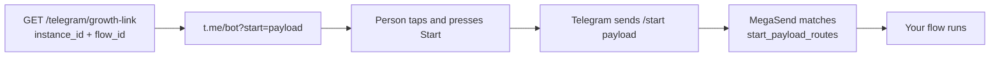

The Telegram channel connects a bot you own to MegaSend. One API call validates the bot token with Telegram, creates the instance and registers the webhook, so messages start arriving in the same inbox as your other channels.

## How the connection works

Telegram uses a bring-your-own-bot model. You create the bot with Telegram's own BotFather and hand MegaSend the token:

1. `POST /telegram/connect` validates the token directly with Telegram.
2. MegaSend creates an instance with `platform: "telegram"` for your account. You do not create it through `/instances/me` first.
3. MegaSend registers the webhook with Telegram, so inbound updates flow immediately.

<Note>
Prefer a visual setup? You can connect Telegram from the dashboard at [app.megasend.co.il](https://app.megasend.co.il) instead of calling the API.
</Note>

## Prerequisites: create a bot

1. Open a chat with [@BotFather](https://t.me/BotFather) in Telegram.
2. Send `/newbot` and follow the prompts to pick a display name and a username ending in `bot`.
3. BotFather replies with an HTTP API token that looks like `123456789:AA...`. That is your `bot_token`.

<Warning>
The bot token is a credential: anyone holding it can send and read messages as your bot. If it leaks, send `/revoke` to BotFather and reconnect with the new token.
</Warning>

## Connect a bot

<CodeGroup>

```bash cURL
curl -X POST "https://api.megasend.co.il/telegram/connect" \
  -H "X-MEGASEND-AUTH: YOUR_ACCESS_TOKEN" \
  -H "Content-Type: application/json" \
  -d '{
    "bot_token": "123456789:AAHf-YOUR-BOT-TOKEN",
    "nickname": "Support bot"
  }'
```

```javascript JavaScript
const response = await fetch('https://api.megasend.co.il/telegram/connect', {
  method: 'POST',
  headers: {
    'X-MEGASEND-AUTH': 'YOUR_ACCESS_TOKEN',
    'Content-Type': 'application/json'
  },
  body: JSON.stringify({
    bot_token: '123456789:AAHf-YOUR-BOT-TOKEN',
    nickname: 'Support bot'
  })
});

const { instance_id, bot_username } = await response.json();
```

```python Python
import requests

result = requests.post(
    'https://api.megasend.co.il/telegram/connect',
    headers={'X-MEGASEND-AUTH': 'YOUR_ACCESS_TOKEN'},
    json={'bot_token': '123456789:AAHf-YOUR-BOT-TOKEN', 'nickname': 'Support bot'}
).json()

print(result['instance_id'], result['bot_username'])
```

</CodeGroup>

### Request fields

<ParamField body="bot_token" type="string" required>
  The HTTP API token BotFather gave you.
</ParamField>

<ParamField body="nickname" type="string">
  A label for the instance inside MegaSend. Never shown to your Telegram users.
</ParamField>

```json
{
  "instance_id": "550e8400-e29b-41d4-a716-446655440000",
  "bot_username": "acme_support_bot",
  "bot_name": "Acme Support"
}
```

Keep `instance_id`. Every messaging endpoint takes it.

## Check the connection

```bash
curl -X GET "https://api.megasend.co.il/telegram/status?instance_id=550e8400-e29b-41d4-a716-446655440000" \
  -H "X-MEGASEND-AUTH: YOUR_ACCESS_TOKEN"
```

```json
{ "connected": true, "bot_username": "acme_support_bot", "webhook_ok": true }
```

| Field | Meaning |
|-------|---------|
| `connected` | A bot token is stored for this instance |
| `bot_username` | The bot's public `@username` |
| `webhook_ok` | The webhook secret is set, so Telegram can deliver updates |

`connected: true` with `webhook_ok: false` means the bot is stored but Telegram is not delivering. Reconnect to re-register the webhook.

## Send and receive messages

Telegram instances use the same messaging endpoints as every other channel. Pass the Telegram `instance_id` and send as usual:

```bash
curl -X POST "https://api.megasend.co.il/messages/send" \
  -H "X-MEGASEND-AUTH: YOUR_ACCESS_TOKEN" \
  -H "Content-Type: application/json" \
  -d '{
    "instance_id": "550e8400-e29b-41d4-a716-446655440000",
    "recipient": "849283746",
    "message_type": "text",
    "text": "Thanks for your message, we are on it."
  }'
```

<Info>
On Telegram, `recipient` is the numeric chat ID, not a phone number. You learn it from the first inbound message, which arrives through [webhooks](/webhooks/setup) and in [Conversations](/chats/conversations) like any other thread.
</Info>

Telegram has no 24-hour window and no template approval, so a bot may reply freely to anyone who has started it. A user who has never pressed **Start** cannot be messaged at all: Telegram requires the person to open the conversation.

## Automations

`GET` and `PUT /telegram/{instance_id}/automation-settings` hold three built-in behaviours plus the deep-link routes.

```bash
curl -X PUT "https://api.megasend.co.il/telegram/550e8400-e29b-41d4-a716-446655440000/automation-settings" \
  -H "X-MEGASEND-AUTH: YOUR_ACCESS_TOKEN" \
  -H "Content-Type: application/json" \
  -d '{
    "welcome": { "enabled": true, "text": "Hi! Ask me about an order, or type help." },
    "faq": {
      "hours": { "type": "reply", "reply_text": "We are open Sunday to Thursday, 9:00 to 18:00." },
      "order":  { "type": "flow", "flow_id": "7c9e6679-7425-40de-944b-e07fc1f90ae7" }
    }
  }'
```

| Key | What it does |
|-----|--------------|
| `welcome` | `{ enabled, text }`. Sent when a user starts the bot. Text up to 2000 characters. |
| `away` | `{ enabled, text, business_hours }`. Sent outside your business hours. |
| `faq` | Keyword to action. Each action is `{ "type": "reply", "reply_text": "..." }` or `{ "type": "flow", "flow_id": "..." }`. |
| `start_payload_routes` | Deep-link payload to flow, normally written for you by the growth-link endpoint below. |

<Warning>
The `PUT` **merges** at the top level. Sending only `{"welcome": {...}}` leaves `away`, `faq` and `start_payload_routes` untouched, but sending `{"faq": {...}}` replaces the whole FAQ map. Read the current settings first if you want to add a single keyword.
</Warning>

FAQ rules: keywords are lowercased and trimmed, at most 80 characters each, and at most **50** keywords are kept. Entries with an empty `reply_text` or a missing `flow_id` are dropped silently. A `flow_id` must belong to your account, otherwise the call fails with `404`.

## Growth links

A Telegram deep link opens your bot with a payload attached, so you know where the person came from and can run a specific flow for them.

```bash
curl -X GET "https://api.megasend.co.il/telegram/growth-link?instance_id=550e8400-e29b-41d4-a716-446655440000&flow_id=7c9e6679-7425-40de-944b-e07fc1f90ae7" \
  -H "X-MEGASEND-AUTH: YOUR_ACCESS_TOKEN"
```

```json
{ "url": "https://t.me/acme_support_bot?start=Ux7fQ2mR", "payload": "Ux7fQ2mR" }
```

Put that URL on a landing page, an ad or a QR code. When someone taps it and presses **Start**, Telegram sends `/start Ux7fQ2mR`, MegaSend matches the payload and runs the flow you named.



Generate one link per campaign. Each call creates a new payload, and all of them keep working.

## Disconnect

```bash
curl -X POST "https://api.megasend.co.il/telegram/disconnect?instance_id=550e8400-e29b-41d4-a716-446655440000" \
  -H "X-MEGASEND-AUTH: YOUR_ACCESS_TOKEN"
```

The stored token and webhook secret are cleared and the webhook is removed at Telegram. Conversation history stays in MegaSend.

## Next steps

<CardGroup cols={2}>
  <Card title="Automation Flows" icon="diagram-project" href="/flows/manage">
    Build the flows your FAQ keywords and growth links run
  </Card>
  <Card title="Conversations" icon="comments" href="/chats/conversations">
    Telegram threads in the shared inbox
  </Card>
  <Card title="Send Messages" icon="paper-plane" href="/messages/send">
    The endpoint every channel shares
  </Card>
  <Card title="Webhooks" icon="webhook" href="/webhooks/setup">
    Receive inbound Telegram messages on your own server
  </Card>
</CardGroup>
