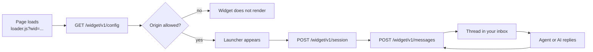

The website widget is a small script tag that adds a chat launcher to your site. It runs in two modes, and you can enable both at once:

- **Channels**: buttons that hand the visitor off to WhatsApp, Messenger, Telegram and the rest, each opening the right app with a message pre-filled.
- **Live chat**: a conversation that happens in the page. It lands in your MegaSend inbox like any other thread, and your AI Employee can answer it.

<Frame caption="Both modes on the same site: live chat with starters on the left, channel buttons on the right">
  
</Frame>

<Note>
A web widget is a MegaSend instance with `platform: "web"`, so its conversations, contacts and analytics work like any other channel. Widgets are **free**: they do not consume a subscription instance slot. You may have up to **10** live widgets per account.
</Note>

## Create a widget

```bash
curl -X POST "https://api.megasend.co.il/web-widget" \
  -H "X-MEGASEND-AUTH: YOUR_ACCESS_TOKEN"
```

```json
{
  "id": "550e8400-e29b-41d4-a716-446655440000",
  "web_widget_public_id": "Ux7fQ2mRk9Lp",
  "snippet": "<script type=\"module\" src=\"https://api.megasend.co.il/widget/v1/loader.js?wid=Ux7fQ2mRk9Lp\"></script>"
}
```

Paste `snippet` into your site's HTML, just before `</body>`. Nothing else is needed: the loader reads its configuration at runtime, so changing settings later never means editing the page again.

`GET /web-widget/{instance_id}/snippet` returns the same snippet if you need it later, and `GET /web-widget` lists the widgets you can configure.

<Warning>
`web_widget_public_id` is public by design: it sits in the page source of your site. It identifies the widget, and it is not a credential. Your API token must never appear in the page.
</Warning>

## Configure it

`PUT /web-widget/{instance_id}/settings` replaces the whole settings object, so send the complete configuration you want.

```bash
curl -X PUT "https://api.megasend.co.il/web-widget/550e8400-e29b-41d4-a716-446655440000/settings" \
  -H "X-MEGASEND-AUTH: YOUR_ACCESS_TOKEN" \
  -H "Content-Type: application/json" \
  -d '{
    "modes": { "channels": true, "live_chat": true },
    "allowed_origins": ["https://shop.example.com"],
    "theme": { "primary_color": "#18534E", "position": "right", "scheme": "auto" },
    "launcher": { "icon": "chat", "greeting": "Need a hand?", "hidden_paths": ["/checkout"] },
    "channels": [
      { "type": "whatsapp", "source": "instance:660f9511-f3ac-52e5-b827-557766551111", "prefill": "Hi! I have a question about" },
      { "type": "telegram", "source": "manual", "handle": "acme_support_bot" }
    ],
    "live_chat": {
      "enabled": true,
      "title": "Support",
      "ai_employee": true,
      "collect_email": "optional",
      "starters": [
        { "question": "Where is my order?" },
        { "question": "What is your return policy?" }
      ],
      "offline_message": "We are away right now. Leave your email and we will reply."
    }
  }'
```

### Settings reference

| Field | Type | Description |
|-------|------|-------------|
| `modes.channels` | boolean | Show the channel buttons. Default `true`. |
| `modes.live_chat` | boolean | Show in-page chat. Default `false`. |
| `allowed_origins` | array | Origins allowed to load the widget. Empty means any origin. |
| `theme.primary_color` | string | Hex color for the launcher and header |
| `theme.position` | string | `left` or `right` |
| `theme.scheme` | string | `auto`, `light` or `dark` |
| `launcher.icon` | string | Launcher glyph |
| `launcher.greeting` | string | Small bubble shown next to the launcher |
| `launcher.hidden_paths` | array | Paths where the widget stays hidden, for example `/checkout` |
| `channels[]` | array | The channel buttons, in order |
| `live_chat.title` | string | Header of the chat panel |
| `live_chat.ai_employee` | boolean | Let the AI Employee answer. Default `true`. |
| `live_chat.starters[]` | array | Suggested questions, each `{ question, answer? }` |
| `live_chat.collect_email` | string | `off`, `optional` or `required` |
| `live_chat.offline_message` | string | Shown when nobody is available |

### Channel buttons

Each entry in `channels` is one button:

| Field | Description |
|-------|-------------|
| `type` | `whatsapp`, `messenger`, `instagram`, `telegram`, `viber`, `line`, `tiktok`, `email`, `phone` or `custom_link` |
| `source` | Either `"manual"` or `"instance:<uuid>"` |
| `handle` | The destination, **required** when `source` is `"manual"` |
| `prefill` | Text already typed when the app opens, where the channel supports it |

`source: "instance:<uuid>"` is the better option for a channel you have connected to MegaSend: the destination is resolved from the live instance, so it keeps working when the underlying number or account changes. Use `"manual"` with a `handle` for a destination MegaSend does not own.

<Warning>
`allowed_origins` matches on scheme, host and port. A bare host or a full page URL is coerced into an origin for you, but anything unparseable is dropped, and a wrong entry means the widget silently refuses to load with a `403` and no visible error. `https://*.example.com` wildcards are supported.
</Warning>

## The AI persona

By default a widget's AI Employee inherits your account's AI settings. Give one widget its own voice without touching the rest:

<CodeGroup>

```bash Read
curl -X GET "https://api.megasend.co.il/web-widget/550e8400-e29b-41d4-a716-446655440000/ai" \
  -H "X-MEGASEND-AUTH: YOUR_ACCESS_TOKEN"
```

```bash Override
curl -X PUT "https://api.megasend.co.il/web-widget/550e8400-e29b-41d4-a716-446655440000/ai" \
  -H "X-MEGASEND-AUTH: YOUR_ACCESS_TOKEN" \
  -H "Content-Type: application/json" \
  -d '{
    "system_prompt": "You answer questions about shipping and returns for Acme. Keep replies under three sentences.",
    "tone": "friendly"
  }'
```

```bash Revert
curl -X DELETE "https://api.megasend.co.il/web-widget/550e8400-e29b-41d4-a716-446655440000/ai" \
  -H "X-MEGASEND-AUTH: YOUR_ACCESS_TOKEN"
```

</CodeGroup>

The `GET` reports where the persona comes from: a custom override, the inherited account default, or none at all. The `DELETE` is idempotent, and reverts to the inherited default.

`POST /web-widget/{instance_id}/ai/preview` runs a draft persona against a sample conversation so you can try wording before saving it.

## Retire a widget

```bash
curl -X DELETE "https://api.megasend.co.il/web-widget/550e8400-e29b-41d4-a716-446655440000" \
  -H "X-MEGASEND-AUTH: YOUR_ACCESS_TOKEN"
```

This **archives** the widget rather than deleting it: the public ID is cleared so the snippet stops working everywhere it is embedded, while the conversations, contacts and message history stay intact. An archived widget stops counting against your limit of 10.

## How a visitor's session works



The `/widget/v1/*` endpoints are the public ones the browser calls. You do not call them yourself: they take the widget's public ID, not your API token. `GET /widget/v1/preview` renders a standalone preview page, which is handy for checking a configuration before you embed it.

## Next steps

<CardGroup cols={2}>
  <Card title="Conversations" icon="comments" href="/chats/conversations">
    Widget threads in the shared inbox
  </Card>
  <Card title="Automation Flows" icon="diagram-project" href="/flows/manage">
    Answer widget conversations automatically
  </Card>
  <Card title="Contacts" icon="address-book" href="/contacts/manage">
    The visitors who leave an email become contacts
  </Card>
  <Card title="QR Codes" icon="qrcode" href="/instances/qr-codes">
    The offline equivalent of a channel button
  </Card>
</CardGroup>
