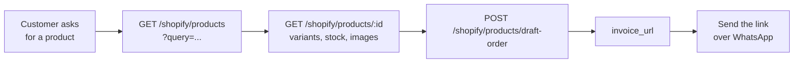

The Shopify integration links your Shopify store to your MegaSend account. Once connected, you can sync store products into your WhatsApp catalog, see a contact's purchase history and abandoned carts alongside their conversation, give the AI chatbot live store context, and attribute Shopify revenue to your WhatsApp campaigns.

## How the Connection Works

The store is connected through the MegaSend app for Shopify, not through an API call:

1. Install the MegaSend app from the Shopify App Store on your store. The app handles the Shopify authorization flow for you.
2. Inside the app, paste a MegaSend access token (create one in the [MegaSend dashboard](https://app.megasend.co.il)).
3. The app verifies the token against the MegaSend API and saves it with your shop. From that point on, MegaSend recognizes the store on any account that holds that token.

Because the link is made through your access token, the same store is visible to all features described on this page: catalog sync, contact context, campaign analytics, and the AI chatbot. The [dashboard](https://app.megasend.co.il) is the usual place to connect the store and monitor the integration.

<Note>
The verification endpoint below is what the Shopify app calls during setup. You normally never call it yourself, but it is useful for checking that a token is valid and seeing which instances it exposes to the store.
</Note>

### Verify a Token

`GET /api/shopify/verify-token` validates the `X-MEGASEND-AUTH` token and returns the WhatsApp instances available to it, in the format the Shopify app expects.

<CodeGroup>

```bash cURL
curl -X GET "https://api.megasend.co.il/api/shopify/verify-token?shop=mystore.myshopify.com" \
  -H "X-MEGASEND-AUTH: YOUR_ACCESS_TOKEN"
```

```python Python
import requests

result = requests.get(
    'https://api.megasend.co.il/api/shopify/verify-token',
    headers={'X-MEGASEND-AUTH': 'YOUR_ACCESS_TOKEN'},
    params={'shop': 'mystore.myshopify.com'}
).json()
print(result['success'])
```

</CodeGroup>

<ParamField query="shop" type="string">
  Optional Shopify shop domain (e.g. `mystore.myshopify.com`). A bare name is normalized to `name.myshopify.com`.
</ParamField>

**Response:**

```json
{
  "shop": {
    "id": "a1b2c3d4-e5f6-7890-abcd-ef1234567890",
    "shop_domain": "mystore.myshopify.com",
    "mega_token": "YOUR_ACCESS_TOKEN",
    "settings": [ ... ]
  },
  "settings": { ... },
  "instances": [ ... ],
  "success": "Token verified successfully",
  "error": null
}
```

If the token is valid but has no instances, `instances` is empty and `error` explains the problem (for example, "No WhatsApp instances found. Please check your token.").

## Catalog Sync

Pull products from the connected Shopify store into the WhatsApp catalog of an instance, so they can be sent in product messages and shown in the in-chat catalog.

<Note>
Catalog management itself (products, orders, commerce settings) is covered in [Catalog & Commerce](/catalog/manage). The instance must have a catalog before syncing: call `GET /catalog/{instance_id}` once to initialize it.
</Note>

### List Syncable Products

`GET /catalog/{instance_id}/shopify/syncable` returns the Shopify products available to sync, with a flag marking products that are already in the catalog.

```bash cURL
curl -X GET "https://api.megasend.co.il/catalog/YOUR_INSTANCE_ID/shopify/syncable" \
  -H "X-MEGASEND-AUTH: YOUR_ACCESS_TOKEN"
```

**Response:**

```json
{
  "products": [
    {
      "shopify_product_id": "gid://shopify/Product/7654321098765",
      "title": "Classic Cotton Shirt",
      "handle": "classic-cotton-shirt",
      "price": "89.99",
      "currency": "ILS",
      "image_url": "https://cdn.shopify.com/s/files/example.jpg",
      "description": "100% cotton shirt",
      "availability": "in stock",
      "sku": "SKU-001",
      "is_already_synced": false
    }
  ],
  "already_synced_ids": ["gid://shopify/Product/1111111111111"],
  "total_available": 24,
  "shop_domain": "mystore.myshopify.com"
}
```

### Sync Selected Products

`POST /catalog/{instance_id}/shopify/sync` copies the selected Shopify products into the WhatsApp catalog. Synced products keep a reference to their Shopify product GID.

<ParamField body="shopify_product_ids" type="string[]" required>
  Shopify product GIDs to sync, between 1 and 100 per request.
</ParamField>

<CodeGroup>

```bash cURL
curl -X POST "https://api.megasend.co.il/catalog/YOUR_INSTANCE_ID/shopify/sync" \
  -H "X-MEGASEND-AUTH: YOUR_ACCESS_TOKEN" \
  -H "Content-Type: application/json" \
  -d '{
    "shopify_product_ids": [
      "gid://shopify/Product/7654321098765",
      "gid://shopify/Product/7654321098766"
    ]
  }'
```

```javascript JavaScript
const response = await fetch(
  'https://api.megasend.co.il/catalog/YOUR_INSTANCE_ID/shopify/sync',
  {
    method: 'POST',
    headers: {
      'X-MEGASEND-AUTH': 'YOUR_ACCESS_TOKEN',
      'Content-Type': 'application/json'
    },
    body: JSON.stringify({
      shopify_product_ids: ['gid://shopify/Product/7654321098765']
    })
  }
);
const result = await response.json();
// { "success": true, "synced_count": 1, "failed_count": 0, "errors": [] }
```

</CodeGroup>

`success` is `true` only when every requested product synced; per-product failures appear in `errors` with `failed_count` incremented.

## Contact Purchase Context

When a contact writes to a Shopify-connected instance, you can look up who they are in the store: profile, order history, and active abandoned carts. The MegaSend inbox uses these endpoints to show the Shopify panel next to a conversation.

### Quick Check

`GET /contacts/{phone}/shopify-check` is a lightweight boolean check: does this contact have any Shopify interactions? It first looks at message history, then falls back to a store lookup by phone number, which also catches organic buyers who purchased on the store without ever receiving a Shopify-originated message.

<ParamField query="instance_id" type="string" required>
  WhatsApp instance ID.
</ParamField>

```bash cURL
curl -X GET "https://api.megasend.co.il/contacts/%2B972501234567/shopify-check?instance_id=YOUR_INSTANCE_ID" \
  -H "X-MEGASEND-AUTH: YOUR_ACCESS_TOKEN"
```

**Response:**

```json
{ "hasShopifyData": true }
```

### Full Context

`GET /contacts/{phone}/shopify-context` returns the customer profile, up to 10 recent orders, and up to 5 active abandoned carts.

<ParamField query="instance_id" type="string" required>
  WhatsApp instance ID.
</ParamField>

<CodeGroup>

```bash cURL
curl -X GET "https://api.megasend.co.il/contacts/%2B972501234567/shopify-context?instance_id=YOUR_INSTANCE_ID" \
  -H "X-MEGASEND-AUTH: YOUR_ACCESS_TOKEN"
```

```javascript JavaScript
const phone = encodeURIComponent('+972501234567');
const response = await fetch(
  `https://api.megasend.co.il/contacts/${phone}/shopify-context?instance_id=YOUR_INSTANCE_ID`,
  { headers: { 'X-MEGASEND-AUTH': 'YOUR_ACCESS_TOKEN' } }
);
const context = await response.json();
```

</CodeGroup>

**Response:**

```json
{
  "hasShopify": true,
  "found": true,
  "customer": {
    "id": "gid://shopify/Customer/123",
    "firstName": "Alice",
    "lastName": "Johnson",
    "email": "alice@example.com",
    "stats": {
      "totalOrders": 5,
      "totalSpent": "450.00",
      "abandonedCartsCount": 1
    }
  },
  "orders": [ ... ],
  "abandonedCarts": [ ... ],
  "shop": {
    "id": 5,
    "domain": "mystore.myshopify.com"
  }
}
```

When the contact has no Shopify interactions, the response is `{ "hasShopify": false }` with a message. When the store is connected but the customer cannot be found, `hasShopify` is `true` and `found` is `false`.

<Note>
Agent accounts need the Shopify view permission on the instance to call the contact context endpoints.
</Note>

## Campaign Revenue Attribution

For campaigns sent from a Shopify-connected instance, MegaSend matches recipients against store customers and attributes orders placed within a 7-day window after the send. Analytics are computed automatically when a campaign completes and refreshed periodically for 7 days to catch late orders.

### Get Campaign Analytics

`GET /campaigns/{campaign_id}/shopify-analytics` returns conversion metrics: overview, a sent to purchased funnel, ROI, and the top converting recipients.

<ParamField query="instance_id" type="string" required>
  Instance the campaign was sent from.
</ParamField>

<CodeGroup>

```bash cURL
curl -X GET "https://api.megasend.co.il/campaigns/CAMPAIGN_ID/shopify-analytics?instance_id=YOUR_INSTANCE_ID" \
  -H "X-MEGASEND-AUTH: YOUR_ACCESS_TOKEN"
```

```javascript JavaScript
const response = await fetch(
  'https://api.megasend.co.il/campaigns/CAMPAIGN_ID/shopify-analytics?instance_id=YOUR_INSTANCE_ID',
  { headers: { 'X-MEGASEND-AUTH': 'YOUR_ACCESS_TOKEN' } }
);
const analytics = await response.json();
```

</CodeGroup>

**Response:**

```json
{
  "campaign_id": "c3d4e5f6-a7b8-9012-cdef-123456789012",
  "has_shopify": true,
  "status": null,
  "message": null,
  "overview": {
    "total_recipients": 250,
    "shopify_customers": 112,
    "conversions": 18,
    "conversion_rate": 7.5,
    "total_revenue": 4230.5,
    "currency": "ILS",
    "avg_order_value": 235.03,
    "shopify_coverage": 44.8
  },
  "funnel": { "sent": 250, "delivered": 240, "read": 190, "purchased": 18 },
  "roi": {
    "meta_message_cost_usd": 12.5,
    "revenue_usd": 1142.0,
    "roas": 91.4,
    "cost_per_conversion_usd": 0.69,
    "net_profit_usd": 1129.5,
    "shop_currency": "ILS"
  },
  "top_converters": [
    {
      "recipient_id": "d4e5f6a7-b8c9-0123-def0-234567890123",
      "phone_number": "+972501234567",
      "shopify_customer_id": "gid://shopify/Customer/123",
      "orders_count": 2,
      "total_revenue": 489.9,
      "first_order_at": "2026-07-14T08:12:00Z",
      "message_status": "read"
    }
  ],
  "attribution_window_days": 7,
  "analytics_updated_at": "2026-07-15T02:00:00Z"
}
```

If no store is connected, the response has `has_shopify: false`. The `status` field explains why conversions may be zero: `ok`, `no_shopify_connection`, `no_recipients`, `db_error`, or `pending`, with a human-readable `message`.

### Refresh Analytics

`POST /campaigns/{campaign_id}/shopify-analytics/refresh` queues a re-computation in the background. Fresh results arrive over your WebSocket connection.

```bash cURL
curl -X POST "https://api.megasend.co.il/campaigns/CAMPAIGN_ID/shopify-analytics/refresh?instance_id=YOUR_INSTANCE_ID" \
  -H "X-MEGASEND-AUTH: YOUR_ACCESS_TOKEN"
```

**Response:**

```json
{
  "status": "refresh_queued",
  "campaign_id": "c3d4e5f6-a7b8-9012-cdef-123456789012",
  "message": "Shopify analytics refresh started. Results will be delivered via WebSocket."
}
```

### List Enriched Recipients

`GET /campaigns/{campaign_id}/shopify-recipients` returns a paginated recipient list enriched with Shopify data: whether each recipient is a store customer, and their orders and revenue inside the attribution window.

<ParamField query="instance_id" type="string" required>
  Instance the campaign was sent from.
</ParamField>

<ParamField query="filter" type="string" default="all">
  One of `all`, `customers`, `converters`, or `non_customers`.
</ParamField>

<ParamField query="page" type="integer" default="1">
  Page number (min 1).
</ParamField>

<ParamField query="per_page" type="integer" default="20">
  Results per page (1 to 100).
</ParamField>

```bash cURL
curl -X GET "https://api.megasend.co.il/campaigns/CAMPAIGN_ID/shopify-recipients?instance_id=YOUR_INSTANCE_ID&filter=converters&page=1&per_page=20" \
  -H "X-MEGASEND-AUTH: YOUR_ACCESS_TOKEN"
```

**Response:**

```json
{
  "items": [
    {
      "id": "d4e5f6a7-b8c9-0123-def0-234567890123",
      "phone_number": "+972501234567",
      "status": "read",
      "shopify_is_customer": true,
      "shopify_customer_id": "gid://shopify/Customer/123",
      "shopify_orders_after_campaign": 2,
      "shopify_revenue_after": 489.9,
      "shopify_first_order_at": "2026-07-14T08:12:00Z",
      "sent_at": "2026-07-13T10:00:00Z",
      "read_at": "2026-07-13T10:02:11Z"
    }
  ],
  "total": 18,
  "page": 1,
  "per_page": 20,
  "total_pages": 1
}
```

## AI Store Context

The AI chatbot has a dedicated Shopify mode: it answers customers using live store data. Two endpoints wire a connected store to an instance's AI settings.

### List Connected Stores

`GET /ai/shopify/stores` returns the Shopify stores linked to your account through your access tokens.

```bash cURL
curl -X GET "https://api.megasend.co.il/ai/shopify/stores" \
  -H "X-MEGASEND-AUTH: YOUR_ACCESS_TOKEN"
```

**Response:**

```json
{
  "stores": [
    {
      "shop_id": "b2c3d4e5-f6a7-8901-bcde-f12345678901",
      "shop_domain": "mystore.myshopify.com",
      "shop_name": null,
      "is_connected": true
    }
  ],
  "total": 1,
  "message": "Found 1 Shopify store(s)"
}
```

An empty list with a `message` means either no access tokens exist yet or no store has saved one of your tokens.

### Select a Store for AI

`POST /ai/shopify/select-store` links a store to an instance's AI settings. This switches the instance's AI to Shopify mode, enables the AI if it was off, and clears any manual system prompt.

<ParamField body="instance_id" type="UUID" required>
  WhatsApp instance ID.
</ParamField>

<ParamField body="shop_id" type="string" required>
  Shopify shop ID from `GET /ai/shopify/stores`.
</ParamField>

<ParamField body="shop_domain" type="string" required>
  Shopify shop domain (e.g. `mystore.myshopify.com`).
</ParamField>

<CodeGroup>

```bash cURL
curl -X POST "https://api.megasend.co.il/ai/shopify/select-store" \
  -H "X-MEGASEND-AUTH: YOUR_ACCESS_TOKEN" \
  -H "Content-Type: application/json" \
  -d '{
    "instance_id": "550e8400-e29b-41d4-a716-446655440000",
    "shop_id": "b2c3d4e5-f6a7-8901-bcde-f12345678901",
    "shop_domain": "mystore.myshopify.com"
  }'
```

```javascript JavaScript
const response = await fetch('https://api.megasend.co.il/ai/shopify/select-store', {
  method: 'POST',
  headers: {
    'X-MEGASEND-AUTH': 'YOUR_ACCESS_TOKEN',
    'Content-Type': 'application/json'
  },
  body: JSON.stringify({
    instance_id: '550e8400-e29b-41d4-a716-446655440000',
    shop_id: 'b2c3d4e5-f6a7-8901-bcde-f12345678901',
    shop_domain: 'mystore.myshopify.com'
  })
});
const aiSettings = await response.json();
```

</CodeGroup>

Returns the full AI settings object with `ai_mode` set to `"shopify"` and `shopify_shop_id` / `shopify_shop_domain` populated.

<Warning>
Selecting a store clears the instance's manual system prompt. Save a copy first if you want to switch back to manual mode later.
</Warning>

## Browse Products and Take an Order

Beyond catalog sync, you can read the live Shopify store from a conversation: search products, look up one product's variants, and turn a chat into a payable checkout link.



### Search Products

```bash
curl -X GET "https://api.megasend.co.il/shopify/products?instance_id=INSTANCE_ID&query=running%20shoes&in_stock_only=true&limit=10" \
  -H "X-MEGASEND-AUTH: YOUR_ACCESS_TOKEN"
```

| Parameter | Type | Required | Description |
|-----------|------|----------|-------------|
| `instance_id` | UUID | ✅ | Instance whose store to search |
| `query` | string | ❌ | Free-text product search |
| `limit` | integer | ❌ | Maximum products to return |
| `in_stock_only` | boolean | ❌ | Skip out-of-stock products |

```json
{
  "success": true,
  "products": [
    { "id": "gid://shopify/Product/123", "title": "Trail Runner", "price": "29.99" }
  ],
  "shop_domain": "mystore.com",
  "total_count": 10,
  "has_more": true,
  "error": null
}
```

Product URLs point at the customer-facing domain rather than `myshopify.com`, so they are safe to send straight to a customer.

### Product Detail and Shop Info

```bash
# Full product with every variant, its stock and its price
curl -X GET "https://api.megasend.co.il/shopify/products/gid%3A%2F%2Fshopify%2FProduct%2F123?instance_id=INSTANCE_ID" \
  -H "X-MEGASEND-AUTH: YOUR_ACCESS_TOKEN"

# Is a store connected at all, and does it have products?
curl -X GET "https://api.megasend.co.il/shopify/products/shop-info?instance_id=INSTANCE_ID" \
  -H "X-MEGASEND-AUTH: YOUR_ACCESS_TOKEN"
```

<Tip>
Call `shop-info` before showing any product UI. It answers `success`, `has_products` and an `error` string, which is enough to tell "no store connected" apart from "store connected but empty".
</Tip>

### Create a Draft Order

```bash
curl -X POST "https://api.megasend.co.il/shopify/products/draft-order" \
  -H "X-MEGASEND-AUTH: YOUR_ACCESS_TOKEN" \
  -H "Content-Type: application/json" \
  -d '{
    "instance_id": "550e8400-e29b-41d4-a716-446655440000",
    "line_items": [
      { "variant_id": "gid://shopify/ProductVariant/456", "quantity": 2 }
    ],
    "customer_phone": "+1234567890",
    "note": "Order via WhatsApp"
  }'
```

```json
{
  "success": true,
  "draft_order_id": "gid://shopify/DraftOrder/789",
  "name": "#D123",
  "invoice_url": "https://mystore.com/...",
  "total_price": "59.98",
  "currency": "USD"
}
```

Send `invoice_url` to the customer and Shopify handles the payment. The draft becomes a real order when they pay, so the store's own notifications, inventory and reporting all behave normally.

<Note>
`variant_id` is a variant, not a product. Take it from the `variants` array in the product detail response, otherwise the draft order fails.
</Note>

## Health Checks

Two unauthenticated endpoints report the state of the integration, useful for monitoring:

```bash cURL
# Shopify integration service
curl -X GET "https://api.megasend.co.il/api/shopify/health"
# { "status": "ok", "service": "shopify-token-verification" }

# Shopify data connection
curl -X GET "https://api.megasend.co.il/contacts/shopify-health"
# { "status": "healthy", "shopify_db": "connected", "message": "..." }
```

`/contacts/shopify-health` reports `healthy`, `unhealthy`, or `error` depending on whether Shopify data is reachable.

## Endpoint Reference

| Method | Path | Description |
|--------|------|-------------|
| `GET` | `/api/shopify/verify-token` | Verify a MegaSend token for the Shopify app |
| `GET` | `/api/shopify/health` | Shopify integration health check |
| `GET` | `/catalog/{instance_id}/shopify/syncable` | List Shopify products available to sync |
| `POST` | `/catalog/{instance_id}/shopify/sync` | Sync Shopify products to the WhatsApp catalog |
| `GET` | `/contacts/{phone}/shopify-check` | Quick check for Shopify data on a contact |
| `GET` | `/contacts/{phone}/shopify-context` | Full customer context: orders and abandoned carts |
| `GET` | `/contacts/shopify-health` | Shopify data connection health check |
| `GET` | `/campaigns/{campaign_id}/shopify-analytics` | Campaign conversion, funnel, and ROI metrics |
| `POST` | `/campaigns/{campaign_id}/shopify-analytics/refresh` | Queue an analytics re-computation |
| `GET` | `/campaigns/{campaign_id}/shopify-recipients` | Recipients enriched with Shopify conversion data |
| `GET` | `/shopify/products` | Search products in the connected store |
| `GET` | `/shopify/products/shop-info` | Shop details and whether products exist |
| `GET` | `/shopify/products/{product_id}` | One product with all its variants |
| `POST` | `/shopify/products/draft-order` | Create a checkout and get an invoice URL |
| `GET` | `/ai/shopify/stores` | List Shopify stores connected to your account |
| `POST` | `/ai/shopify/select-store` | Link a store to an instance's AI settings |

## Next Steps

- [Manage your catalog](/catalog/manage) for products, orders, and commerce messages
- [Create a campaign](/campaigns/manage) and track its Shopify conversions
- [Manage contacts](/contacts/manage) to organize the customers writing in
- [Set up webhooks](/webhooks/setup) for real-time message and delivery events
