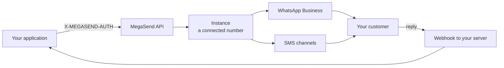

## Welcome to MegaSend API

MegaSend is a WhatsApp Business API platform for sending messages, managing conversations and automating customer engagement at scale. One REST API covers the whole path from your application to the customer's phone, across WhatsApp and a growing set of other channels.

An **instance** is one connected channel account, usually a WhatsApp number. Almost every endpoint takes an `instance_id` to say which one to act on. Start at [Quickstart](/quickstart) to create one and send a message in a few minutes.

## What You Can Build

<CardGroup cols={2}>
  <Card
    title="Automated Messaging"
    icon="message"
    href="/messages/send"
  >
    Send personalized messages, notifications, and marketing campaigns to your customers
  </Card>
  <Card
    title="Template Management"
    icon="file-lines"
    href="/templates/create"
  >
    Create, manage, and deploy WhatsApp message templates for consistent branding
  </Card>
  <Card
    title="Incoming Messages"
    icon="comments"
    href="/messages/incoming"
  >
    Receive and manage incoming WhatsApp messages from your customers
  </Card>
  <Card
    title="Analytics & Insights"
    icon="chart-line"
    href="/analytics/overview"
  >
    Track message delivery, engagement rates, and customer interaction metrics
  </Card>
</CardGroup>

## Key Features

### 🚀 Enterprise-Ready
- **Rate Limiting**: Intelligent throttling to respect WhatsApp limits
- **Auto-Scaling**: Handle millions of messages with automatic scaling
- **Security**: Enterprise-grade encryption and authentication

### 📱 WhatsApp Business Integration
- **Official API**: Direct integration with WhatsApp Business API
- **Template Messages**: Support for all WhatsApp message types
- **Media Support**: Send images, documents, videos, and audio files
- **Interactive Messages**: Buttons, lists, and quick replies

### 🔧 Developer Experience
- **RESTful API**: Clean, intuitive endpoints with comprehensive documentation
- **Simple Authentication**: Multiple auth methods including the convenient X-MEGASEND-AUTH header
- **OpenAPI Client Generation**: Generate a typed client in any language from our spec at `/openapi.json`
- **Webhooks**: Real-time event notifications for message status updates
- **Local Testing**: Test using your own WhatsApp number; use [ngrok](https://ngrok.com) to expose local webhook endpoints during development

### 📊 Analytics & Monitoring
- **Real-time Metrics**: Message delivery, read rates, and engagement analytics
- **Custom Reports**: Detailed analytics with exportable data
- **Performance Monitoring**: Track API response times and system health
- **Usage Analytics**: Monitor API usage and billing information

## Getting Started

<CardGroup cols={3}>
  <Card
    title="Authentication"
    icon="key"
    href="/authentication"
  >
    Learn how to authenticate with our API using JWT tokens, access tokens, or the simple X-MEGASEND-AUTH header
  </Card>
  <Card
    title="Quick Start"
    icon="rocket"
    href="/quickstart"
  >
    Send your first message in under 5 minutes with our step-by-step guide
  </Card>
  <Card
    title="API Reference"
    icon="code"
    href="/api-reference/introduction"
  >
    Explore our complete API reference with examples and response schemas
  </Card>
</CardGroup>

## Use Cases

### Customer Support
Automate customer support with intelligent routing, template responses, and real-time agent handoff capabilities.

### Marketing Campaigns
Send targeted marketing messages with rich media, track engagement, and optimize campaign performance.

### Transactional Notifications
Deliver order confirmations, shipping updates, appointment reminders, and other critical notifications.

### E-commerce Integration
Integrate with your e-commerce platform for cart abandonment, order updates, and customer service.

## API Structure

Our RESTful API uses clean, predictable URLs without version prefixes. All endpoints are accessed directly at `https://api.megasend.co.il/`. We maintain backward compatibility and provide advance notice of any breaking changes. See [Versioning & Deprecation](/resources/versioning).

Every endpoint is listed with its parameters, schemas and a runnable playground in the [API Reference](/api-reference/introduction) tab.

## Rate Limits

To ensure optimal performance for all users, our API implements intelligent rate limiting that respects WhatsApp Business API quotas. When a rate limit is exceeded, the API returns `429 Too Many Requests` with a JSON body containing a `retry_after_seconds` field. There are no `X-RateLimit-*` response headers.

## Support

Need help? Our support team is here to assist you:

- **Email Support**: [team@weblix.co.il](mailto:team@weblix.co.il)
- **Dashboard**: [app.megasend.co.il](https://app.megasend.co.il)
- **Documentation**: Comprehensive guides and examples in this documentation

<CardGroup cols={2}>
  <Card title="Quickstart" icon="rocket" href="/quickstart">
    Connect a number and send your first message
  </Card>
  <Card title="The 24-Hour Window" icon="clock" href="/guides/24-hour-window">
    The one WhatsApp rule that decides what you may send
  </Card>
  <Card title="Channels" icon="tower-broadcast" href="/instances/twilio">
    Twilio, Telnyx, 019, InforU and LINE alongside WhatsApp
  </Card>
  <Card title="Integrations" icon="puzzle-piece" href="/integrations/shopify">
    Shopify, Calendly, Google Calendar and AI assistants
  </Card>
</CardGroup> 