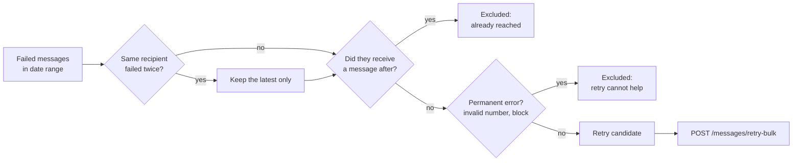

Messages fail for reasons that are often temporary: a Meta rate limit, an expired access token, a network blip. MegaSend keeps every failed message, and the retry endpoints let you re-send them safely, in bulk, without messaging the same person twice.

## How retrying works

The API does not simply re-send everything that failed. `POST /messages/retry-candidates` applies a set of filters first, so the list you get back is the list that is actually worth retrying.



<Note>
Every exclusion is reported back to you as a count, so you can show your users why 400 failures became 250 retries.
</Note>

## Get retry candidates

<CodeGroup>

```bash cURL
curl -X POST "https://api.megasend.co.il/messages/retry-candidates" \
  -H "X-MEGASEND-AUTH: YOUR_ACCESS_TOKEN" \
  -H "Content-Type: application/json" \
  -d '{
    "instance_id": "550e8400-e29b-41d4-a716-446655440000",
    "start_date": "2026-08-01T00:00:00Z",
    "end_date": "2026-08-31T23:59:59Z"
  }'
```

```javascript JavaScript
const response = await fetch('https://api.megasend.co.il/messages/retry-candidates', {
  method: 'POST',
  headers: {
    'X-MEGASEND-AUTH': 'YOUR_ACCESS_TOKEN',
    'Content-Type': 'application/json'
  },
  body: JSON.stringify({
    instance_id: '550e8400-e29b-41d4-a716-446655440000',
    start_date: '2026-08-01T00:00:00Z',
    end_date: '2026-08-31T23:59:59Z'
  })
});

const { candidates, total_failed, total_excluded } = await response.json();
console.log(`${candidates.length} of ${total_failed} failures are worth retrying`);
```

```python Python
import requests

response = requests.post(
    'https://api.megasend.co.il/messages/retry-candidates',
    headers={'X-MEGASEND-AUTH': 'YOUR_ACCESS_TOKEN'},
    json={
        'instance_id': '550e8400-e29b-41d4-a716-446655440000',
        'start_date': '2026-08-01T00:00:00Z',
        'end_date': '2026-08-31T23:59:59Z'
    }
)

data = response.json()
print(f"{data['total_candidates']} of {data['total_failed']} failures are worth retrying")
```

</CodeGroup>

### Request fields

| Field | Type | Required | Description |
|-------|------|----------|-------------|
| `instance_id` | UUID | ✅ | Instance whose failures you want to inspect |
| `start_date` | datetime | ❌ | Only consider failures from this time onward |
| `end_date` | datetime | ❌ | Only consider failures up to this time |
| `platform` | string | ❌ | Narrow to one source, for example `shopify` or `api` |

### Response

```json
{
  "candidates": [
    {
      "message_id": "a1b2c3d4-e5f6-7890-abcd-ef1234567890",
      "recipient": "+972501234567",
      "message_type": "template",
      "failed_at": "2026-08-14T09:12:33Z",
      "error_message": "(131026) Message undeliverable",
      "template_name": "order_update"
    }
  ],
  "total_failed": 412,
  "total_candidates": 250,
  "total_excluded": 162,
  "excluded_success_after": 88,
  "excluded_duplicate": 61,
  "excluded_permanent_error": 13
}
```

| Field | Description |
|-------|-------------|
| `total_failed` | Every failure found in the range, before filtering |
| `total_candidates` | What is safe to retry, and what `candidates` contains |
| `excluded_success_after` | Recipients who received a later message anyway |
| `excluded_duplicate` | Older failures for a recipient who failed more than once |
| `excluded_permanent_error` | Errors that a retry cannot fix, such as an invalid number |

## Retry in bulk

Pass the message IDs you want to re-send. The work happens in a background worker, so the call returns immediately with a task ID.

<CodeGroup>

```bash cURL
curl -X POST "https://api.megasend.co.il/messages/retry-bulk" \
  -H "X-MEGASEND-AUTH: YOUR_ACCESS_TOKEN" \
  -H "Content-Type: application/json" \
  -d '{
    "instance_id": "550e8400-e29b-41d4-a716-446655440000",
    "message_ids": [
      "a1b2c3d4-e5f6-7890-abcd-ef1234567890",
      "b2c3d4e5-f6a7-8901-bcde-f23456789012"
    ]
  }'
```

```javascript JavaScript
const ids = candidates.map(c => c.message_id).slice(0, 500);

const response = await fetch('https://api.megasend.co.il/messages/retry-bulk', {
  method: 'POST',
  headers: {
    'X-MEGASEND-AUTH': 'YOUR_ACCESS_TOKEN',
    'Content-Type': 'application/json'
  },
  body: JSON.stringify({
    instance_id: '550e8400-e29b-41d4-a716-446655440000',
    message_ids: ids
  })
});

const { task_id, total } = await response.json();
```

```python Python
ids = [c['message_id'] for c in data['candidates']][:500]

response = requests.post(
    'https://api.megasend.co.il/messages/retry-bulk',
    headers={'X-MEGASEND-AUTH': 'YOUR_ACCESS_TOKEN'},
    json={
        'instance_id': '550e8400-e29b-41d4-a716-446655440000',
        'message_ids': ids
    }
)

task_id = response.json()['task_id']
```

</CodeGroup>

```json
{
  "status": "processing",
  "total": 250,
  "task_id": "c7f1e2a0-9b3d-4c8e-8f21-0a5d6e7b8c90",
  "message": "Retry task dispatched for 250 messages. Progress updates via WebSocket."
}
```

<Warning>
A single request accepts at most **500 message IDs**. Duplicate IDs in the same request are collapsed before dispatch. Split larger jobs into batches and send them one after another.
</Warning>

When nothing is left to retry the call returns `"status": "completed"` with `total: 0` and no `task_id`.

## Track retry progress

Progress arrives over WebSocket as `bulk_retry_progress` events. If your client cannot hold a socket open, for example an embedded Shopify app or a server-side script, poll the task instead.

<CodeGroup>

```bash cURL
curl -X GET "https://api.megasend.co.il/messages/retry-task/c7f1e2a0-9b3d-4c8e-8f21-0a5d6e7b8c90" \
  -H "X-MEGASEND-AUTH: YOUR_ACCESS_TOKEN"
```

```python Python
import time

while True:
    status = requests.get(
        f'https://api.megasend.co.il/messages/retry-task/{task_id}',
        headers={'X-MEGASEND-AUTH': 'YOUR_ACCESS_TOKEN'}
    ).json()

    if status['ready']:
        print(status['result'])
        break

    time.sleep(3)
```

</CodeGroup>

```json
{
  "task_id": "c7f1e2a0-9b3d-4c8e-8f21-0a5d6e7b8c90",
  "status": "SUCCESS",
  "ready": true,
  "successful": true,
  "result": {
    "sent": 231,
    "failed": 12,
    "skipped": 7
  }
}
```

| Field | Description |
|-------|-------------|
| `status` | Worker state: `PENDING`, `STARTED`, `SUCCESS` or `FAILURE` |
| `ready` | `true` once the task has finished, successfully or not |
| `successful` | `true` only when the task completed without raising |
| `result` | Final counts, available once `ready` is `true` |

Polling is scoped to the account that dispatched the task. Another account polling the same ID gets a `403`.

## Retrying one message yourself

If you re-send a single failed message with `POST /messages/send` rather than the bulk endpoint, stamp the original so it never shows up as a candidate again:

```bash
curl -X POST "https://api.megasend.co.il/messages/retry-mark/a1b2c3d4-e5f6-7890-abcd-ef1234567890" \
  -H "X-MEGASEND-AUTH: YOUR_ACCESS_TOKEN"
```

```json
{ "success": true }
```

The bulk worker does this for you. You only need it for retries you perform on your own.

## Practical pattern

<Steps>
  <Step title="Collect the candidates">
    Call `/messages/retry-candidates` for the instance and the period you care about. Show the exclusion counts to whoever approves the retry.
  </Step>
  <Step title="Let a human confirm">
    Retries send real messages and consume real message credits. Confirm the count before dispatching.
  </Step>
  <Step title="Dispatch in batches of 500">
    Send the IDs to `/messages/retry-bulk` and keep each returned `task_id`.
  </Step>
  <Step title="Watch the outcome">
    Subscribe to `bulk_retry_progress`, or poll `/messages/retry-task/{task_id}` every few seconds until `ready` is `true`.
  </Step>
</Steps>

<Warning>
Retries are subject to the same rules as any other send. A message that failed because the 24-hour window closed will fail again unless you retry with a template. See [The 24-Hour Window & Opt-in](/guides/24-hour-window).
</Warning>

## Next steps

<CardGroup cols={2}>
  <Card title="Message Responses" icon="chart-line" href="/messages/responses">
    Find the failures in the first place by filtering on `status=failed`
  </Card>
  <Card title="Send Messages" icon="paper-plane" href="/messages/send">
    The send endpoint the retry worker calls on your behalf
  </Card>
</CardGroup>
